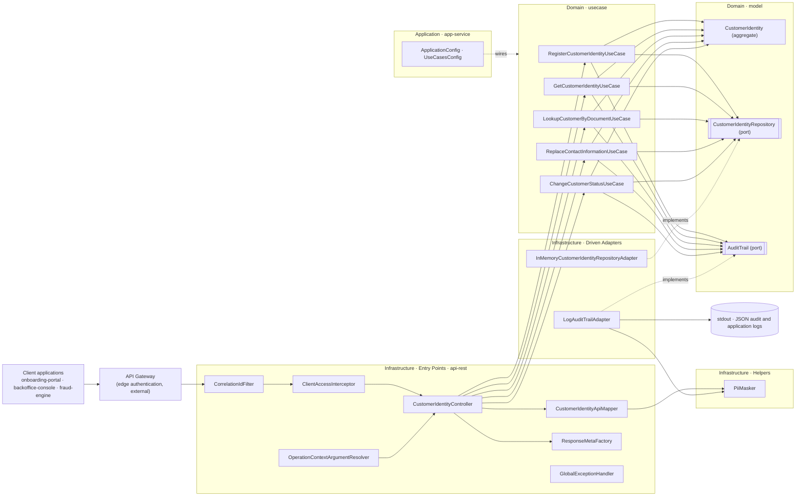
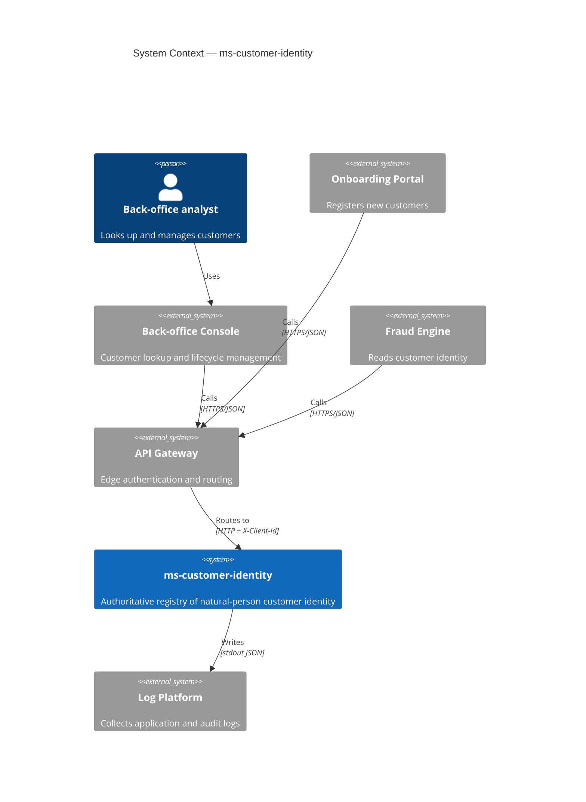
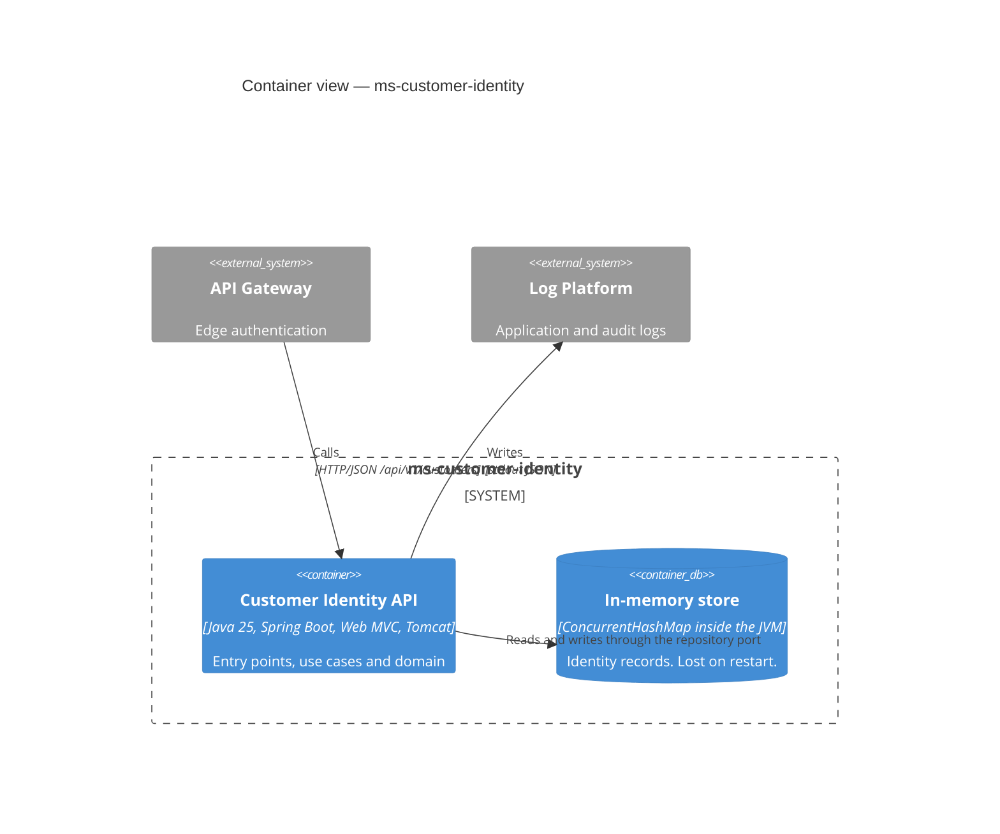
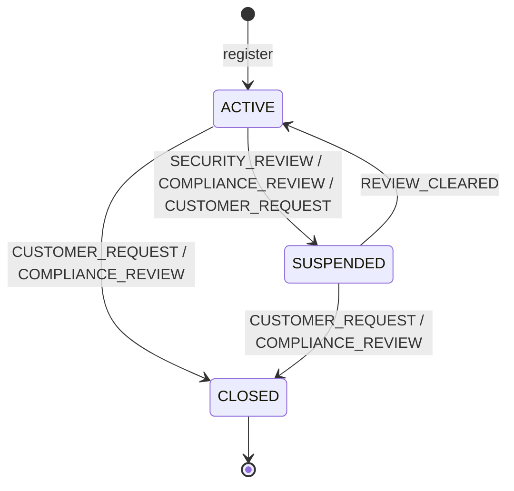
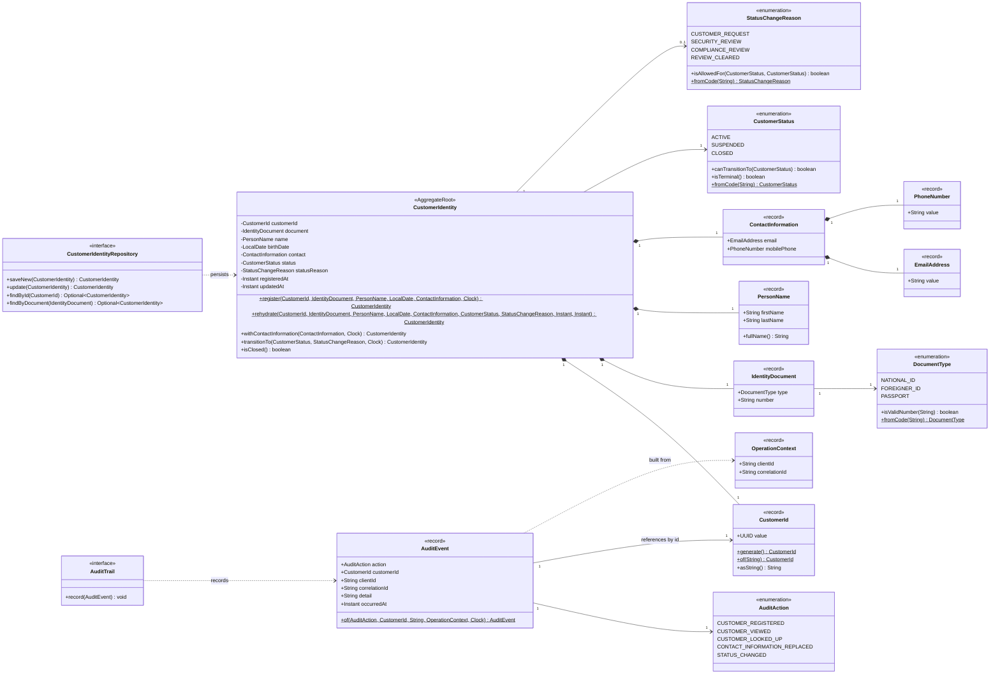
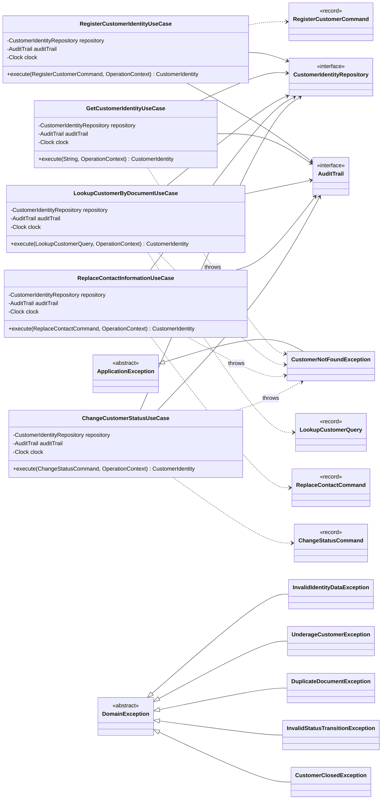
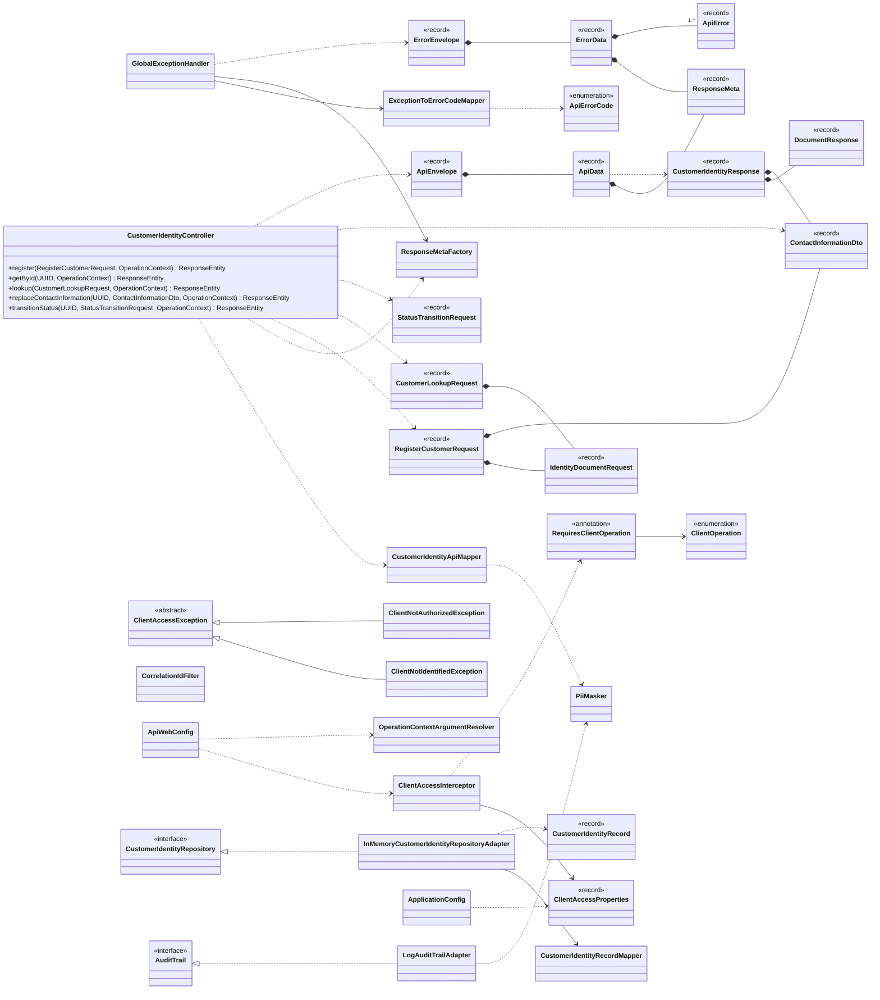
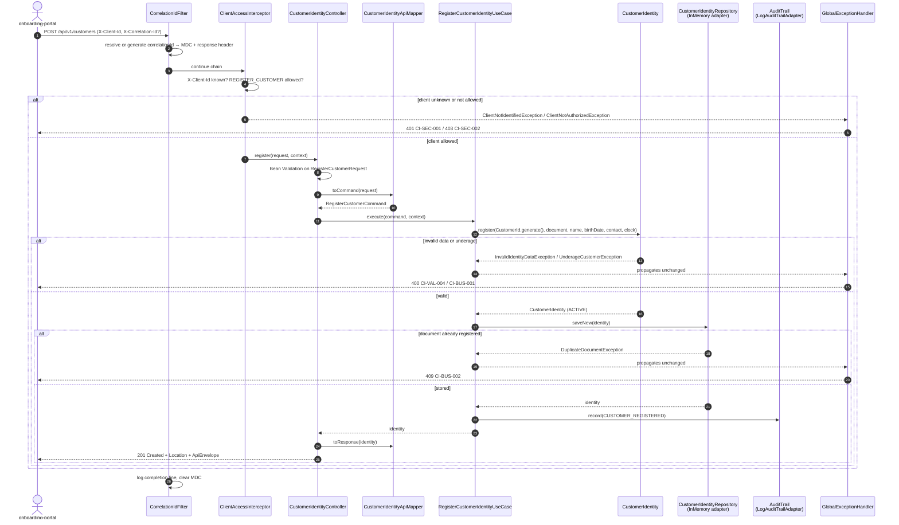
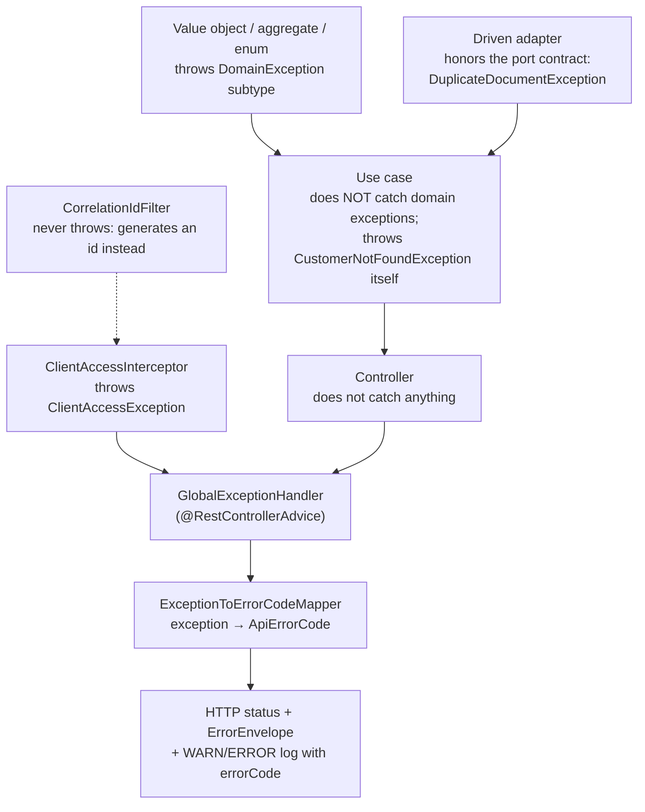

# ms-customer-identity

**Customer Identity Registry — Project 01 of 20 · Banking & FinTech Backend Portfolio**

`Junior` · `Imperative` · `Spring Web MVC` · `Contract-first` · `Clean Architecture`

> This README is the complete specification of the service. It tells you what to build and why. It deliberately contains **no implementation code**: every method body is yours to write.

---

## 1. Project Overview

`ms-customer-identity` is the authoritative registry of natural-person customer identity for a fictional digital bank. It:

- assigns each customer a stable, opaque `customerId`;
- guarantees at most one identity per identity document;
- governs the customer lifecycle (active, suspended, closed);
- exposes identity data only to authorized client applications, and audits every access.

As the first project in the portfolio, its technical scope is deliberately narrow and its architectural standard deliberately high. There is no database: persistence is an in-memory adapter behind a port. That constraint is the point. After Project 02 teaches JPA, you come back here and add a PostgreSQL adapter. If `domain/model` and `domain/usecase` need zero changes, you have *proven* dependency inversion instead of just claiming it.

| Item | Value |
|---|---|
| Project | 01 / 20 — Stage 1 (Junior) |
| Programming model | Imperative (Spring Web MVC, one thread per request) |
| BIAN Service Domain | Party Reference Data Directory |
| Business capability | Maintain authoritative identity reference data for natural-person customers |
| Technical microservice | `ms-customer-identity` |
| API | Customer Identity API v1 — `/api/v1/customers` |
| Stack | Java 25 · Spring Boot 4.x (as generated by the scaffold) · Spring Web MVC · Jakarta Bean Validation · Spring Boot Actuator · Micrometer · JUnit 5 · Mockito · AssertJ · ArchUnit · Gradle |
| Persistence | In-memory driven adapter (PostgreSQL arrives in Project 02) |
| Security | Client identification plus a per-client operation allow-list, behind an API gateway (JWT arrives in Project 03) |
| Estimated effort | 25–35 hours |
| Next project | 02 — `ms-account-transaction-log` |

**What you will be able to say when it's done:**

> "I built a contract-first Spring Boot service on Clean Architecture. The domain has zero framework dependencies — an ArchUnit test proves it — and I swapped the persistence adapter without touching the domain or the use cases."

---

## 2. Business Context and Functional Scope

### 2.1 Business requirement

A digital bank's channels (onboarding portal, back-office console) and downstream services (MFA, payments, fraud) all need customer identity data. Today each channel stores its own copy. The result is duplicate customers, inconsistent contact data, and personal data scattered across systems.

The bank needs **one authoritative registry** that:

1. assigns every natural-person customer a stable, opaque identifier;
2. allows only one identity per identity document;
3. controls the customer lifecycle;
4. serves identity data only to authorized client applications, recording who accessed which identity and when.

### 2.2 From BIAN to code

```text
BIAN Service Domain     : Party Reference Data Directory
        ↓
Business Capability     : Maintain authoritative identity reference data for natural-person customers
        ↓
Technical Microservice  : ms-customer-identity
        ↓
API                     : Customer Identity API v1  (/api/v1/customers)
        ↓
Use Cases               : UC-01 Register · UC-02 Get · UC-03 Look up · UC-04 Replace contact · UC-05 Change status
        ↓
Domain Model            : CustomerIdentity aggregate + value objects
```

**How the Service Domain relates to the microservice.** A BIAN Service Domain is a *business responsibility boundary*. Party Reference Data Directory covers reference data about parties in general: persons, organizations, their relationships and their addresses. This microservice realizes only a **subset**: natural persons, with core identity, contact data and lifecycle.

Other slices of the same domain could become separate microservices later (legal-entity identity, party relationships). That is why the rule "one Service Domain = one microservice" doesn't hold. The microservice name describes its *technical responsibility* (`ms-customer-identity`), not the BIAN label.

> Verification note: the Service Domain name was checked against the BIAN Service Landscape v13.0 matrix. Confirm its formal description on the BIAN portal before quoting it in an interview.

**Transactional or informational?** This service is **transactional**: it owns and changes identity data. No separate information service (such as `ms-customer-information`) is created. Consumers need point reads that the owner can serve directly, and a separate read model would add consistency cost with no benefit at this scale. Project 13 shows when that trade-off flips.

### 2.3 Actors and client applications

| Actor | Type | Client ID | What it needs |
|---|---|---|---|
| Onboarding portal | Client application | `onboarding-portal` | Register customers, look them up, update contact data |
| Back-office console | Client application | `backoffice-console` | Look up customers, suspend, reactivate, close |
| Fraud engine | Client application | `fraud-engine` | Read identity by `customerId` |
| API gateway | External infrastructure | — | Authenticates callers at the edge. Not built in this project. |
| Security and audit team | People | — | A trail of who accessed which identity |

### 2.4 Use cases

| ID | Name | Required client operation | Main rules | Success | Business failures |
|---|---|---|---|---|---|
| UC-01 | Register customer identity | `REGISTER_CUSTOMER` | Valid document for its type; adult (18+); unique document; valid contact data | 201 with an `ACTIVE` identity | Invalid data (400), underage (400), document already registered (409) |
| UC-02 | Get customer identity | `READ_CUSTOMER` | Access is audited | 200 | Not found (404) |
| UC-03 | Look up by identity document | `LOOKUP_CUSTOMER` | Document travels in a POST body, never in the URL; access is audited | 200 | Not found (404) |
| UC-04 | Replace contact information | `UPDATE_CONTACT` | Not allowed when `CLOSED`; replacing with identical data changes nothing (idempotent) | 200 | Customer closed (409), not found (404) |
| UC-05 | Change lifecycle status | `CHANGE_STATUS` | Transition and reason must be allowed (§4.7); `CLOSED` is terminal | 200 | Invalid transition (409), not found (404) |

### 2.5 Functional requirements

| ID | Requirement |
|---|---|
| FR-01 | The service assigns a random UUID `customerId` at registration. It never changes and is never reused. |
| FR-02 | At most one identity may exist per (document type, document number), including under concurrent registration requests. |
| FR-03 | The identity document cannot be changed after registration. |
| FR-04 | A customer must be at least 18 years old on the registration date. |
| FR-05 | Lifecycle transitions follow the state machine in §4.7. |
| FR-06 | Contact information cannot be changed for a `CLOSED` customer. |
| FR-07 | Every successful operation, including reads, produces an audit record. |
| FR-08 | Responses never include the full document number or the birth date. |
| FR-09 | Every response uses the envelope in §6.4 and carries `X-Correlation-Id`. |
| FR-10 | Every endpoint requires an identified client application that is allowed to perform that endpoint's operation. |

### 2.6 Non-functional requirements

| ID | Category | Requirement |
|---|---|---|
| NFR-01 | Latency (learning target) | Reads: p95 < 100 ms. Writes: p95 < 150 ms. Measured locally at 50 requests/second. |
| NFR-02 | Availability (learning target) | 99.5% of requests without a 5xx response |
| NFR-03 | Maintainability | `domain/model` and `domain/usecase` have no framework dependencies, verified by ArchUnit and `validateStructure` |
| NFR-04 | Privacy | No raw document number, birth date, name, full email or full phone number in logs |
| NFR-05 | Observability | Structured JSON logs with a correlation ID, liveness and readiness health, HTTP metrics |
| NFR-06 | Testability | At least 90% line coverage on domain and use cases; mutation testing on the domain |
| NFR-07 | Portability | Runs as a container using the scaffold-generated Dockerfile |

### 2.7 Out of scope

- Identity verification / KYC (document checks, biometrics)
- Addresses, legal entities (companies), party relationships
- End-user authentication — the gateway handles authentication in this project; JWT validation arrives in Project 03
- A database — deliberate, see §8.1
- Publishing events — Project 11 onward
- Rate limiting and idempotency keys — Projects 06 and 09

---

## 3. Architecture and Learning Objectives

### 3.1 Learning objectives

By the end of this project you should be able to:

1. Generate and navigate a Clean Architecture project with the scaffold, and explain what each module is allowed to depend on.
2. Model a domain with an aggregate root, value objects, enums and invariants — without any framework.
3. Implement a state machine as domain behavior, not as `if` statements in a controller.
4. Keep four representations of the same concept separate (domain entity, request DTO, persistence model, response model) and explain why.
5. Write an OpenAPI contract first, then implement code that conforms to it.
6. Design an exception taxonomy per layer and map it to HTTP responses in one place.
7. Tell filters, interceptors and controller advice apart, and use each one correctly.
8. Produce structured logs with correlation IDs and prove that personal data never leaks into them.
9. Enforce architecture rules automatically with ArchUnit.

### 3.2 Programming model

```text
Programming Model:
Imperative
```

- **Why imperative is appropriate here.** Every request is short. Apart from writing logs and the HTTP socket itself, there is no remote I/O: the store is in memory and there are no downstream calls. Thread-per-request is the simplest correct model, and it's the baseline you need to master before reactive programming makes sense.
- **Where blocking I/O happens.** Reading the request from the socket, writing the response, and writing logs. In Project 02 the database call becomes the dominant blocking operation.
- **How threads are used.** Embedded Tomcat takes a worker thread from its pool for each request (`server.tomcat.threads.max` defaults to 200). That same thread runs the filter, interceptor, controller, use case and adapter, then returns to the pool. Anything stored in thread-local state — such as the MDC used for logging — **must be cleared** before the thread is reused, or it leaks into the next request.
- **Transaction handling.** None in this project. The in-memory store has no transactions, so atomicity comes from `ConcurrentHashMap` operations (§8.4). Project 02 introduces `@Transactional`, and you will see exactly what it adds.
- **Limits at high concurrency.** Each in-flight request holds a platform thread, with its stack memory and context-switching cost. When requests wait on slow I/O, the pool fills up and new requests queue or are rejected. Two answers exist: virtual threads (`spring.threads.virtual.enabled=true`, studied in Project 16) and reactive programming (Project 04 onward). Neither is needed here.

### 3.3 Clean Architecture in the scaffold

| Layer | Scaffold module | What it contains here | May depend on |
|---|---|---|---|
| Domain — model | `domain/model` | `CustomerIdentity`, value objects, enums, domain exceptions, ports `CustomerIdentityRepository` and `AuditTrail`, `AuditEvent`, `OperationContext` | JDK only |
| Domain — use cases | `domain/usecase` | Five use cases, commands and queries, application exceptions | `model` |
| Entry points | `infrastructure/entry-points/api-rest` | Controller, DTOs, mapper, error handling, correlation filter, client-access interceptor | `usecase`, `model`, `pii-masking`, Spring Web MVC, Bean Validation |
| Driven adapters | `infrastructure/driven-adapters/in-memory-repository` | In-memory repository adapter, persistence record, mapper | `model` |
| Driven adapters | `infrastructure/driven-adapters/log-audit-trail` | Audit adapter that writes structured audit logs | `model`, `pii-masking`, SLF4J |
| Helpers | `infrastructure/helpers/pii-masking` | `PiiMasker` | JDK only |
| Application (composition root) | `applications/app-service` | `MainApplication`, `UseCasesConfig`, `ApplicationConfig`, `application.yaml` | All modules |

### 3.4 Dependency inversion in this project

Take `RegisterCustomerIdentityUseCase` as the example:

- The use case needs to store an identity. It depends on the **interface** `CustomerIdentityRepository`, which lives in `domain/model`, inside the domain.
- `InMemoryCustomerIdentityRepositoryAdapter` lives in `driven-adapters` and **implements** that interface. The adapter depends on the domain; the domain knows nothing about the adapter.
- `app-service` wires them together at startup.

So the **compile-time dependency points inward** (adapter → domain), while the **runtime call goes outward** (use case → adapter). That inversion is what lets you replace the in-memory adapter with PostgreSQL without editing a single line in the domain.

`AuditTrail` follows the same pattern. So does `java.time.Clock`: time is injected rather than read with `Instant.now()`, which makes every time-dependent rule (the age check, timestamps) deterministic in tests.

### 3.5 Architecture diagram



### 3.6 C4 — System Context



### 3.7 C4 — Container



A C4 Component diagram is not required at the junior stage. The architecture diagram in §3.5 already shows the components.

### 3.8 Generating the project

These commands were checked against the scaffold documentation for plugin 4.6.2. First create a `build.gradle` that contains only the plugin block shown on the scaffold's *Getting Started* page, then run:

```bash
gradle wrapper
./gradlew ca --package=io.github.davidmillan5.customeridentity --type=imperative --name=ms-customer-identity --java-version=25 --lombok=true --metrics=true --mutation=true
./gradlew generateModel --name=CustomerIdentity
./gradlew generateModel --name=Audit
./gradlew generateUseCase --name=RegisterCustomerIdentity
./gradlew generateUseCase --name=GetCustomerIdentity
./gradlew generateUseCase --name=LookupCustomerByDocument
./gradlew generateUseCase --name=ReplaceContactInformation
./gradlew generateUseCase --name=ChangeCustomerStatus
./gradlew gep --type=restmvc
./gradlew gda --type=generic --name=in-memory-repository
./gradlew gda --type=generic --name=log-audit-trail
./gradlew generateHelper --name=pii-masking
./gradlew validateStructure
```

Notes:

- `generateModel --name=Audit` creates `Audit` and `AuditRepository`. Rename them to `AuditEvent` and `AuditTrail` (§5.2).
- Replace `io.github.davidmillan5` with your own namespace if it differs. Never keep the plugin's default package.
- The scaffold derives module and package names from the names you pass. If what it generates differs from §5.1, **keep the generated name and update this README**. Consistency beats my naming.
- Install a JDK 25 before running `ca --java-version=25`. Otherwise Gradle fails to find a matching toolchain.

---

## 4. Detailed Domain Model

### 4.1 Aggregate boundary

- **`CustomerIdentity` is the only aggregate.** It is the consistency boundary: one operation changes exactly one identity, and all of its value objects change with it or not at all.
- **`AuditEvent` is not part of the aggregate.** It is a separate record that points to the customer **by id**, not by object reference.
- **Document uniqueness is a set-based invariant.** It is a rule about *all* identities, so a single aggregate can't enforce it by itself. It is enforced by the repository contract: `saveNew` must be atomic. This distinction — rules one aggregate can check vs rules that need the whole set — is a classic DDD interview question.

### 4.2 Entity: `CustomerIdentity` (aggregate root)

| Attribute | Java Type | Required | Description | Validation |
|---|---|---|---|---|
| `customerId` | `CustomerId` | Yes | Opaque, immutable identifier | Generated at registration (random UUID); never reused |
| `document` | `IdentityDocument` | Yes | Identity document (type and number). Immutable after registration. | Format rules per type (§4.3); unique across all identities (INV-02) |
| `name` | `PersonName` | Yes | Legal first and last name | §4.3 |
| `birthDate` | `LocalDate` | Yes | Date of birth | Not in the future; age ≥ 18 at registration; age ≤ 120 |
| `contact` | `ContactInformation` | Yes | Email and mobile phone | §4.3 |
| `status` | `CustomerStatus` | Yes | Lifecycle status | `ACTIVE` at registration; changes only through §4.7 |
| `statusReason` | `StatusChangeReason` | No | Reason for the most recent status change | `null` until the first transition; must be allowed for that transition |
| `registeredAt` | `Instant` | Yes | Registration instant (UTC) | Set once, from the injected `Clock` |
| `updatedAt` | `Instant` | Yes | Last modification instant (UTC) | Never before `registeredAt`; changes only when state actually changes |

Constants: `MINIMUM_AGE_YEARS = 18` and `MAXIMUM_AGE_YEARS = 120`.

### 4.3 Value objects

Every value object is **immutable**, validates itself on construction, and is compared **by value**.

| Value object | Attribute | Java Type | Required | Description | Validation |
|---|---|---|---|---|---|
| `CustomerId` | `value` | `UUID` | Yes | Customer identifier | Not null. Parsing from text rejects anything that isn't a UUID. |
| `IdentityDocument` | `type` | `DocumentType` | Yes | Kind of document | Not null |
| `IdentityDocument` | `number` | `String` | Yes | Document number | Trimmed and upper-cased, then checked against the format rule for its type (table below) |
| `PersonName` | `firstName` | `String` | Yes | Given name(s) | Trimmed; repeated internal spaces collapsed to one; 1–60 characters; letters from any alphabet plus spaces, apostrophes and hyphens; must start with a letter |
| `PersonName` | `lastName` | `String` | Yes | Family name(s) | Same rules as `firstName` |
| `ContactInformation` | `email` | `EmailAddress` | Yes | Contact email | Not null |
| `ContactInformation` | `mobilePhone` | `PhoneNumber` | Yes | Contact mobile phone | Not null |
| `EmailAddress` | `value` | `String` | Yes | Email address | Trimmed and lower-cased; at most 254 characters; exactly one `@`; non-empty local part; domain containing at least one dot |
| `PhoneNumber` | `value` | `String` | Yes | Mobile number | E.164 format: `^\+[1-9][0-9]{7,14}$` |

**Document number format per type.** These are illustrative project rules, *not* official national formats:

| `DocumentType` | Allowed characters | Length |
|---|---|---|
| `NATIONAL_ID` | Digits only | 5–12 |
| `FOREIGNER_ID` | Letters and digits | 5–15 |
| `PASSPORT` | Letters and digits | 6–20 |

> **Personal-data rule for value objects:** Java records generate a `toString()` that prints **every** field. `IdentityDocument`, `EmailAddress`, `PhoneNumber` and `PersonName` must override `toString()` so they never print raw personal data. Otherwise one careless log statement leaks it.

### 4.4 Enums

| Enum | Values | Behavior |
|---|---|---|
| `DocumentType` | `NATIONAL_ID`, `FOREIGNER_ID`, `PASSPORT` | `isValidNumber(String)` applies the per-type format rule. `fromCode(String)` converts text safely (see note). |
| `CustomerStatus` | `ACTIVE`, `SUSPENDED`, `CLOSED` | `canTransitionTo(CustomerStatus)`, `isTerminal()`, `fromCode(String)` |
| `StatusChangeReason` | `CUSTOMER_REQUEST`, `SECURITY_REVIEW`, `COMPLIANCE_REVIEW`, `REVIEW_CLEARED` | `isAllowedFor(CustomerStatus from, CustomerStatus to)`, `fromCode(String)` |
| `AuditAction` | `CUSTOMER_REGISTERED`, `CUSTOMER_VIEWED`, `CUSTOMER_LOOKED_UP`, `CONTACT_INFORMATION_REPLACED`, `STATUS_CHANGED` | None |

**Why `fromCode` exists.** `Enum.valueOf` throws `IllegalArgumentException` for unknown text. That generic exception would surface as a 500 error. `fromCode` throws the domain's `InvalidIdentityDataException` instead, which correctly becomes a 400.

### 4.5 Supporting domain types

| Type | Attribute | Java Type | Required | Description | Validation |
|---|---|---|---|---|---|
| `OperationContext` | `clientId` | `String` | Yes | The client application performing the operation | Not blank |
| `OperationContext` | `correlationId` | `String` | Yes | Correlation identifier of the interaction | Not blank. The domain treats it as opaque text. |
| `AuditEvent` | `action` | `AuditAction` | Yes | What happened | Not null |
| `AuditEvent` | `customerId` | `CustomerId` | Yes | Which identity was affected | Not null |
| `AuditEvent` | `clientId` | `String` | Yes | Who did it | Not blank |
| `AuditEvent` | `correlationId` | `String` | Yes | Links the audit record to the request's logs | Not blank |
| `AuditEvent` | `detail` | `String` | No | Short detail with **no personal data**, for example `ACTIVE->SUSPENDED:SECURITY_REVIEW` | At most 200 characters |
| `AuditEvent` | `occurredAt` | `Instant` | Yes | When it happened | From the injected `Clock` |

`OperationContext` is how "who is calling" reaches the use cases without the domain knowing about HTTP headers, thread-locals or Spring.

### 4.6 Relationships and cardinality

| From | To | Cardinality | Kind |
|---|---|---|---|
| `CustomerIdentity` | `CustomerId` | 1 → 1 | Composition (the identity's key) |
| `CustomerIdentity` | `IdentityDocument` | 1 → 1 | Composition |
| `CustomerIdentity` | `PersonName` | 1 → 1 | Composition |
| `CustomerIdentity` | `ContactInformation` | 1 → 1 | Composition |
| `ContactInformation` | `EmailAddress` | 1 → 1 | Composition |
| `ContactInformation` | `PhoneNumber` | 1 → 1 | Composition |
| `IdentityDocument` | `DocumentType` | 1 → 1 | Association |
| `CustomerIdentity` | `CustomerStatus` | 1 → 1 | Association |
| `CustomerIdentity` | `StatusChangeReason` | 1 → 0..1 | Association |
| `AuditEvent` | `CustomerId` | 1 → 1 | Reference by id |
| `AuditEvent` | `AuditAction` | 1 → 1 | Association |
| Identity document (across all identities) | `CustomerIdentity` | 1 → 0..1 | Set-based uniqueness (INV-02) |

### 4.7 Lifecycle and state transitions



| From → To | Allowed reasons |
|---|---|
| `ACTIVE` → `SUSPENDED` | `SECURITY_REVIEW`, `COMPLIANCE_REVIEW`, `CUSTOMER_REQUEST` |
| `SUSPENDED` → `ACTIVE` | `REVIEW_CLEARED` |
| `ACTIVE` → `CLOSED` | `CUSTOMER_REQUEST`, `COMPLIANCE_REVIEW` |
| `SUSPENDED` → `CLOSED` | `CUSTOMER_REQUEST`, `COMPLIANCE_REVIEW` |
| `CLOSED` → anything | None — `CLOSED` is terminal |
| Any status → the same status | Not allowed |

### 4.8 Business invariants

| ID | Invariant | Enforced by |
|---|---|---|
| INV-01 | `customerId` is immutable and unique | `CustomerIdentity` (no setter); random UUID generation |
| INV-02 | At most one identity per (document type, document number) | `CustomerIdentityRepository.saveNew` contract, implemented atomically |
| INV-03 | The document is immutable after registration | `CustomerIdentity` exposes no way to change it; the adapter rejects updates that try |
| INV-04 | Age is between 18 and 120 on the registration date; the birth date is not in the future | `CustomerIdentity.register` |
| INV-05 | A new identity is `ACTIVE` with no status reason | `CustomerIdentity.register` |
| INV-06 | Transitions and reasons follow §4.7; `CLOSED` is terminal | `CustomerStatus`, `StatusChangeReason`, `CustomerIdentity.transitionTo` |
| INV-07 | Contact information cannot change while `CLOSED` | `CustomerIdentity.withContactInformation` |
| INV-08 | `updatedAt ≥ registeredAt`; `updatedAt` changes only on a real state change | `CustomerIdentity` |
| INV-09 | Types carrying personal data never print it in `toString()` | Value objects, commands and records |

### 4.9 Four models of the same concept

| Aspect | Domain entity | Request DTO | Persistence model | Response model |
|---|---|---|---|---|
| Type | `CustomerIdentity` | `RegisterCustomerRequest` and related DTOs | `CustomerIdentityRecord` | `CustomerIdentityResponse` inside `ApiEnvelope` |
| Module | `domain/model` | `entry-points/api-rest` | `driven-adapters/in-memory-repository` | `entry-points/api-rest` |
| Purpose | Enforce business invariants | Carry and validate contract input | Store data in a technology-friendly shape | Expose only what consumers need |
| Field types | Value objects, enums, `Instant` | Strings, `LocalDate`, nested records | Strings, `LocalDate`, `Instant` | Strings and `Instant` |
| Document number | Full, validated | Full (it's the input) | Full | **Masked** (last 4 characters) |
| Birth date | Yes | Yes | Yes | **Not exposed** (data minimization) |
| Changes when… | Business rules change | The contract version changes | The storage technology changes | The contract version changes |

If you merged these four into one class, a change in any of them would ripple into all the others. That is the concrete reason to keep them apart.

### 4.10 Domain class diagram



---

## 5. Detailed Class and Package Specification

Throughout this section, `{base}` means `io.github.davidmillan5.customeridentity`.

### 5.1 Module and package tree

```text
ms-customer-identity/
├── contracts/
│   └── customer-identity-api.yaml                  # OpenAPI 3.0.3 — source of truth (§6)
├── applications/app-service/src/main/java/{base}/
│   ├── MainApplication.java                         # generated
│   └── config/
│       ├── UseCasesConfig.java                      # generated — registers every class ending in "UseCase"
│       └── ApplicationConfig.java                   # Clock bean, configuration properties
├── domain/model/src/main/java/{base}/model/
│   ├── customeridentity/
│   │   ├── CustomerIdentity.java  CustomerId.java  IdentityDocument.java  DocumentType.java
│   │   ├── PersonName.java  ContactInformation.java  EmailAddress.java  PhoneNumber.java
│   │   ├── CustomerStatus.java  StatusChangeReason.java
│   │   ├── gateways/CustomerIdentityRepository.java
│   │   └── exception/
│   │       ├── DomainException.java  InvalidIdentityDataException.java  UnderageCustomerException.java
│   │       └── DuplicateDocumentException.java  InvalidStatusTransitionException.java  CustomerClosedException.java
│   ├── audit/
│   │   ├── AuditEvent.java  AuditAction.java
│   │   └── gateways/AuditTrail.java
│   └── shared/OperationContext.java
├── domain/usecase/src/main/java/{base}/usecase/
│   ├── registercustomeridentity/   RegisterCustomerIdentityUseCase.java  RegisterCustomerCommand.java
│   ├── getcustomeridentity/        GetCustomerIdentityUseCase.java
│   ├── lookupcustomerbydocument/   LookupCustomerByDocumentUseCase.java  LookupCustomerQuery.java
│   ├── replacecontactinformation/  ReplaceContactInformationUseCase.java  ReplaceContactCommand.java
│   ├── changecustomerstatus/       ChangeCustomerStatusUseCase.java  ChangeStatusCommand.java
│   └── exception/                  ApplicationException.java  CustomerNotFoundException.java
├── infrastructure/entry-points/api-rest/src/main/java/{base}/api/
│   ├── CustomerIdentityController.java
│   ├── dto/request/    RegisterCustomerRequest.java  IdentityDocumentRequest.java  CustomerLookupRequest.java  StatusTransitionRequest.java
│   ├── dto/shared/     ContactInformationDto.java
│   ├── dto/response/   CustomerIdentityResponse.java  DocumentResponse.java  ApiEnvelope.java  ApiData.java
│   │                   ErrorEnvelope.java  ErrorData.java  ResponseMeta.java  ApiError.java
│   ├── mapper/         CustomerIdentityApiMapper.java
│   ├── support/        ResponseMetaFactory.java  OperationContextArgumentResolver.java  ApiWebConfig.java
│   ├── security/       ClientAccessInterceptor.java  RequiresClientOperation.java  ClientOperation.java  ClientAccessProperties.java
│   │                   ClientAccessException.java  ClientNotIdentifiedException.java  ClientNotAuthorizedException.java
│   ├── observability/  CorrelationIdFilter.java
│   └── error/          GlobalExceptionHandler.java  ApiErrorCode.java  ExceptionToErrorCodeMapper.java
├── infrastructure/driven-adapters/in-memory-repository/src/main/java/{base}/inmemory/
│   └── InMemoryCustomerIdentityRepositoryAdapter.java  CustomerIdentityRecord.java  CustomerIdentityRecordMapper.java
├── infrastructure/driven-adapters/log-audit-trail/src/main/java/{base}/audittrail/
│   └── LogAuditTrailAdapter.java
├── infrastructure/helpers/pii-masking/src/main/java/{base}/piimasking/
│   └── PiiMasker.java
└── deployment/Dockerfile                            # generated
```

### 5.2 Domain — `domain/model`

Every class in this module imports only from the JDK. Lombok is allowed if you decide to use it (decision AD-02); Spring is not.

#### `CustomerIdentity`
- **Package:** `{base}.model.customeridentity`
- **Kind:** `final` class — aggregate root, immutable
- **Responsibility:** Holds one customer's identity and enforces every invariant that doesn't need other identities (INV-01, INV-03 to INV-09).

| Attribute | Java type | Visibility | Purpose |
|---|---|---|---|
| `customerId` | `CustomerId` | `private final` | Identity of the aggregate |
| `document` | `IdentityDocument` | `private final` | Identity document |
| `name` | `PersonName` | `private final` | Legal name |
| `birthDate` | `LocalDate` | `private final` | Date of birth |
| `contact` | `ContactInformation` | `private final` | Contact data |
| `status` | `CustomerStatus` | `private final` | Lifecycle status |
| `statusReason` | `StatusChangeReason` | `private final` | Reason for the last transition, or `null` |
| `registeredAt` | `Instant` | `private final` | Registration instant |
| `updatedAt` | `Instant` | `private final` | Last change instant |
| `MINIMUM_AGE_YEARS` | `int` | `public static final` | 18 |
| `MAXIMUM_AGE_YEARS` | `int` | `public static final` | 120 |

| Method | Returns | What it must do |
|---|---|---|
| `static register(CustomerId customerId, IdentityDocument document, PersonName name, LocalDate birthDate, ContactInformation contact, Clock clock)` | `CustomerIdentity` | Reject any `null` argument (`InvalidIdentityDataException` naming the field). Compute today's date from `clock` in UTC. Reject a future birth date or an age above 120 (`InvalidIdentityDataException`, field `birthDate`). Reject an age below 18 (`UnderageCustomerException`). Return an `ACTIVE` identity with a `null` reason and both timestamps set to `Instant.now(clock)`. |
| `static rehydrate(CustomerId, IdentityDocument, PersonName, LocalDate, ContactInformation, CustomerStatus, StatusChangeReason, Instant registeredAt, Instant updatedAt)` | `CustomerIdentity` | Rebuild an identity from storage **without** re-running registration-time rules such as the age check. Still reject `null` for required fields and `updatedAt` earlier than `registeredAt`. Adapters must use only this method to rebuild identities. |
| `withContactInformation(ContactInformation newContact, Clock clock)` | `CustomerIdentity` | Throw `CustomerClosedException` if `CLOSED`. If `newContact` equals the current contact, return `this` unchanged (idempotent; `updatedAt` untouched). Otherwise return a copy with the new contact and a new `updatedAt`. |
| `transitionTo(CustomerStatus target, StatusChangeReason reason, Clock clock)` | `CustomerIdentity` | Throw `InvalidStatusTransitionException` unless `status.canTransitionTo(target)` **and** `reason.isAllowedFor(status, target)` are both true. Return a copy with the new status, reason and `updatedAt`. |
| `isClosed()` | `boolean` | True when the status is `CLOSED` |
| `customerId()`, `document()`, `name()`, `birthDate()`, `contact()`, `status()`, `statusReason()`, `registeredAt()`, `updatedAt()` | field types | Read-only accessors |
| `equals(Object)` / `hashCode()` | `boolean` / `int` | Equality **by `customerId` only**, because this is an entity |
| `toString()` | `String` | Include `customerId` and `status` only. Never personal data. |

- **Relationships:** composes `CustomerId`, `IdentityDocument`, `PersonName` and `ContactInformation`; uses the `CustomerStatus` and `StatusChangeReason` enums.
- **Dependencies:** `java.time.*`, `java.util.*`, and its own value objects and exceptions.

#### `CustomerId`
- **Package:** `{base}.model.customeridentity` · **Kind:** `record`
- **Responsibility:** A type-safe identifier, so an id can't be confused with any other `String` or `UUID`.

| Attribute | Java type | Visibility | Purpose |
|---|---|---|---|
| `value` | `UUID` | record component | The identifier |

| Method | Returns | What it must do |
|---|---|---|
| Compact constructor | — | Reject `null` |
| `static generate()` | `CustomerId` | Create a random UUID |
| `static of(String raw)` | `CustomerId` | Parse text. Throw `InvalidIdentityDataException` (field `customerId`) if it isn't a UUID. |
| `asString()` | `String` | Canonical lower-case text form |

#### `IdentityDocument`
- **Package:** `{base}.model.customeridentity` · **Kind:** `record`
- **Responsibility:** A validated (type, number) pair. It is also the key for the uniqueness rule.

| Attribute | Java type | Visibility | Purpose |
|---|---|---|---|
| `type` | `DocumentType` | record component | Kind of document |
| `number` | `String` | record component | Normalized number |

| Method | Returns | What it must do |
|---|---|---|
| Compact constructor | — | Reject a `null` type. Trim and upper-case the number, then check it with `type.isValidNumber`. Violations throw `InvalidIdentityDataException` (field `document.number`). |
| `toString()` | `String` | Print the type and a masked number only |

#### `PersonName`, `ContactInformation`, `EmailAddress`, `PhoneNumber`
- **Package:** `{base}.model.customeridentity` · **Kind:** `record`
- **Responsibility:** Self-validating value objects with the rules in §4.3.

| Class | Components | Methods |
|---|---|---|
| `PersonName` | `String firstName`, `String lastName` | Compact constructor (normalize and validate; field names `firstName` / `lastName`); `fullName()` returns `String`; `toString()` must not print names |
| `ContactInformation` | `EmailAddress email`, `PhoneNumber mobilePhone` | Compact constructor rejects `null`s |
| `EmailAddress` | `String value` | Compact constructor (normalize and validate; field `contact.email`); masked `toString()` |
| `PhoneNumber` | `String value` | Compact constructor (E.164 check; field `contact.mobilePhone`); masked `toString()` |

#### `DocumentType`, `CustomerStatus`, `StatusChangeReason`
- **Package:** `{base}.model.customeridentity` · **Kind:** `enum`

| Enum | Method | Returns | What it must do |
|---|---|---|---|
| `DocumentType` | `isValidNumber(String number)` | `boolean` | Apply the per-type format from §4.3 |
| `DocumentType` | `static fromCode(String code)` | `DocumentType` | Exact match on the name. Otherwise throw `InvalidIdentityDataException` (field `document.type`). |
| `CustomerStatus` | `canTransitionTo(CustomerStatus target)` | `boolean` | Implement the status part of §4.7. A transition to the same status returns `false`. |
| `CustomerStatus` | `isTerminal()` | `boolean` | True only for `CLOSED` |
| `CustomerStatus` | `static fromCode(String code)` | `CustomerStatus` | As above (field `targetStatus`) |
| `StatusChangeReason` | `isAllowedFor(CustomerStatus from, CustomerStatus to)` | `boolean` | Implement the reason column of §4.7 |
| `StatusChangeReason` | `static fromCode(String code)` | `StatusChangeReason` | As above (field `reason`) |

#### `CustomerIdentityRepository` (port)
- **Package:** `{base}.model.customeridentity.gateways` · **Kind:** `interface`
- **Responsibility:** Everything the use cases need from storage — and nothing about how storage works.

| Method | Returns | Contract |
|---|---|---|
| `saveNew(CustomerIdentity identity)` | `CustomerIdentity` | Store a **new** identity. It must be **atomic** with respect to document uniqueness: if another identity already holds the same document, throw `DuplicateDocumentException` and store nothing. |
| `update(CustomerIdentity identity)` | `CustomerIdentity` | Replace an existing identity. Its document must match the stored one. Calling it for a missing id is a programming error, not a business case. |
| `findById(CustomerId id)` | `Optional<CustomerIdentity>` | Empty if absent |
| `findByDocument(IdentityDocument document)` | `Optional<CustomerIdentity>` | Empty if absent |

#### `AuditEvent`, `AuditAction`, `AuditTrail`
- **Packages:** `{base}.model.audit` (the event and the enum), `{base}.model.audit.gateways` (the port)

| Class | Kind | Method | Returns | What it must do |
|---|---|---|---|---|
| `AuditEvent` | `record` (fields in §4.5) | Compact constructor | — | Validate the §4.5 rules |
| `AuditEvent` | | `static of(AuditAction action, CustomerId customerId, String detail, OperationContext context, Clock clock)` | `AuditEvent` | Build an event from the operation context and `Instant.now(clock)` |
| `AuditAction` | `enum` | — | — | Values from §4.4 |
| `AuditTrail` | `interface` (port) | `record(AuditEvent event)` | `void` | Persist or emit the audit record. Failure behavior is decision AD-07. |

#### `OperationContext`
- **Package:** `{base}.model.shared` · **Kind:** `record` (`String clientId`, `String correlationId`)
- **Responsibility:** Carry the caller's identity and the correlation id into use cases without any web types. The compact constructor rejects blank values.

#### Domain exceptions
- **Package:** `{base}.model.customeridentity.exception`

| Class | Extends | Constructor | Extra accessors | Raised when |
|---|---|---|---|---|
| `DomainException` | `RuntimeException` (abstract) | `protected DomainException(String message)` | — | Base type for every business-rule violation |
| `InvalidIdentityDataException` | `DomainException` | `(String field, String message)` | `field()` returns `String` | A value object or enum rejects its input |
| `UnderageCustomerException` | `DomainException` | `(int minimumAgeYears)` | `minimumAgeYears()` returns `int` | Age below 18 at registration |
| `DuplicateDocumentException` | `DomainException` | `(DocumentType type)` | `documentType()` | The document is already registered. **The message must never contain the number.** |
| `InvalidStatusTransitionException` | `DomainException` | `(CustomerStatus from, CustomerStatus to, StatusChangeReason reason)` | `from()`, `to()`, `reason()` | Transition or reason not allowed |
| `CustomerClosedException` | `DomainException` | `(CustomerId customerId)` | `customerId()` | A change was attempted on a `CLOSED` identity |

### 5.3 Use cases — `domain/usecase`

Use cases have **no annotations**. The generated `UseCasesConfig` registers every class whose name ends in `UseCase` and injects its constructor dependencies.

| Use case | Constructor dependencies | Method | Returns |
|---|---|---|---|
| `RegisterCustomerIdentityUseCase` | `CustomerIdentityRepository`, `AuditTrail`, `Clock` | `execute(RegisterCustomerCommand command, OperationContext context)` | `CustomerIdentity` |
| `GetCustomerIdentityUseCase` | `CustomerIdentityRepository`, `AuditTrail`, `Clock` | `execute(String customerId, OperationContext context)` | `CustomerIdentity` |
| `LookupCustomerByDocumentUseCase` | `CustomerIdentityRepository`, `AuditTrail`, `Clock` | `execute(LookupCustomerQuery query, OperationContext context)` | `CustomerIdentity` |
| `ReplaceContactInformationUseCase` | `CustomerIdentityRepository`, `AuditTrail`, `Clock` | `execute(ReplaceContactCommand command, OperationContext context)` | `CustomerIdentity` |
| `ChangeCustomerStatusUseCase` | `CustomerIdentityRepository`, `AuditTrail`, `Clock` | `execute(ChangeStatusCommand command, OperationContext context)` | `CustomerIdentity` |

What each `execute` must do:

- **Register**
  1. Build the value objects from the command. Invalid input throws domain exceptions.
  2. Call `CustomerIdentity.register` with `CustomerId.generate()`.
  3. Call `saveNew`. **Do not** call `findByDocument` first — check-then-act is a race condition (§8.4).
  4. Record `CUSTOMER_REGISTERED`.
  5. Return the stored identity.
- **Get:** Parse the id with `CustomerId.of`. Call `findById`, or throw `CustomerNotFoundException`. Record `CUSTOMER_VIEWED`. Return.
- **Lookup:** Build the `IdentityDocument`. Call `findByDocument`, or throw `CustomerNotFoundException`. **The exception message must not contain the document.** Record `CUSTOMER_LOOKED_UP`. Return.
- **Replace contact**
  1. Load the identity, or throw `CustomerNotFoundException`.
  2. Build the new `ContactInformation`.
  3. Call `withContactInformation`.
  4. If the result is the same instance (nothing changed), return it **without** calling `update` or recording an audit event.
  5. Otherwise call `update`, record `CONTACT_INFORMATION_REPLACED`, and return.
- **Change status**
  1. Load the identity, or throw `CustomerNotFoundException`.
  2. Convert the target status and reason with `fromCode`.
  3. Call `transitionTo`.
  4. Call `update`.
  5. Record `STATUS_CHANGED` with a detail such as `ACTIVE->SUSPENDED:SECURITY_REVIEW`.
  6. Return.

Commands and queries (package: the use case's own package; all are `record`s):

| Record | Components | Note |
|---|---|---|
| `RegisterCustomerCommand` | `String documentType`, `String documentNumber`, `String firstName`, `String lastName`, `LocalDate birthDate`, `String email`, `String mobilePhone` | Override `toString()` to hide personal data |
| `LookupCustomerQuery` | `String documentType`, `String documentNumber` | Override `toString()` |
| `ReplaceContactCommand` | `String customerId`, `String email`, `String mobilePhone` | Override `toString()` |
| `ChangeStatusCommand` | `String customerId`, `String targetStatus`, `String reason` | No personal data |

Commands carry **raw values**. Use cases turn them into value objects, so validation errors always come from the domain, regardless of which entry point called.

Application exceptions (`{base}.usecase.exception`):

| Class | Extends | Constructor | Raised when |
|---|---|---|---|
| `ApplicationException` | `RuntimeException` (abstract) | `protected ApplicationException(String message)` | Base type for application-flow failures |
| `CustomerNotFoundException` | `ApplicationException` | `(String searchKind)` — `"BY_ID"` or `"BY_DOCUMENT"` | The requested identity doesn't exist. No personal data in the message. |

"Not found" is an application exception, not a domain one: no business invariant was broken — the lookup simply came back empty.

### 5.4 Entry point — `infrastructure/entry-points/api-rest`

#### `CustomerIdentityController`
- **Package:** `{base}.api` · **Annotations:** `@RestController`, `@RequestMapping("/api/v1/customers")`
- **Responsibility:** Translate HTTP to use-case calls and back. **No business logic.**
- **Dependencies:** the five use cases, `CustomerIdentityApiMapper`, `ResponseMetaFactory`

| Method | Client operation | Returns | What it must do |
|---|---|---|---|
| `register(@Valid @RequestBody RegisterCustomerRequest request, OperationContext context)` | `REGISTER_CUSTOMER` | `ResponseEntity<ApiEnvelope<CustomerIdentityResponse>>` | 201 with a `Location` header `/api/v1/customers/{id}` |
| `getById(@PathVariable UUID customerId, OperationContext context)` | `READ_CUSTOMER` | same | 200 |
| `lookup(@Valid @RequestBody CustomerLookupRequest request, OperationContext context)` | `LOOKUP_CUSTOMER` | same | 200 (`POST /lookups`) |
| `replaceContactInformation(@PathVariable UUID customerId, @Valid @RequestBody ContactInformationDto request, OperationContext context)` | `UPDATE_CONTACT` | same | 200 (`PUT`) |
| `transitionStatus(@PathVariable UUID customerId, @Valid @RequestBody StatusTransitionRequest request, OperationContext context)` | `CHANGE_STATUS` | same | 200 (`POST /status-transitions`) |

Every method carries `@RequiresClientOperation(...)` with the operation shown. The `OperationContext` parameter is filled in by `OperationContextArgumentResolver`.

#### DTOs (all `record`s)

| Class | Package | Components and Bean Validation |
|---|---|---|
| `RegisterCustomerRequest` | `{base}.api.dto.request` | `@NotNull @Valid IdentityDocumentRequest document`; `@NotBlank @Size(max=60) String firstName`; `@NotBlank @Size(max=60) String lastName`; `@NotNull @Past LocalDate birthDate`; `@NotNull @Valid ContactInformationDto contact` |
| `IdentityDocumentRequest` | `{base}.api.dto.request` | `@NotBlank @Pattern(NATIONAL_ID\|FOREIGNER_ID\|PASSPORT) String type`; `@NotBlank @Pattern(^[A-Za-z0-9]{5,20}$) String number` |
| `CustomerLookupRequest` | `{base}.api.dto.request` | `@NotNull @Valid IdentityDocumentRequest document` |
| `StatusTransitionRequest` | `{base}.api.dto.request` | `@NotBlank @Pattern(ACTIVE\|SUSPENDED\|CLOSED) String targetStatus`; `@NotBlank @Pattern(CUSTOMER_REQUEST\|SECURITY_REVIEW\|COMPLIANCE_REVIEW\|REVIEW_CLEARED) String reason` |
| `ContactInformationDto` | `{base}.api.dto.shared` | `@NotBlank @Email @Size(max=254) String email`; `@NotBlank @Pattern(^\+[1-9][0-9]{7,14}$) String mobilePhone` — used in requests **and** responses |
| `CustomerIdentityResponse` | `{base}.api.dto.response` | `String customerId`, `DocumentResponse document`, `String firstName`, `String lastName`, `ContactInformationDto contact`, `String status`, `String statusReason`, `Instant registeredAt`, `Instant updatedAt` |
| `DocumentResponse` | `{base}.api.dto.response` | `String type`, `String maskedNumber` |
| `ApiEnvelope<T>` | `{base}.api.dto.response` | `ApiData<T> data` |
| `ApiData<T>` | `{base}.api.dto.response` | `ResponseMeta meta`, `T response` |
| `ErrorEnvelope` | `{base}.api.dto.response` | `ErrorData data` |
| `ErrorData` | `{base}.api.dto.response` | `ResponseMeta meta`, `List<ApiError> errors` |
| `ResponseMeta` | `{base}.api.dto.response` | `String clientId` (nullable), `Instant timestamp`, `UUID messageId` |
| `ApiError` | `{base}.api.dto.response` | `String code`, `String title`, `String detail`, `String field` (nullable) |

The DTOs use `String` + `@Pattern` for enum values on purpose. An unknown value then produces a field-level `CI-VAL-001`, not an unreadable-body `CI-VAL-002`. It also keeps domain enums out of the API layer. Why validate here *and* in the domain? DTO validation checks the **contract shape** quickly and reports per-field errors. Domain validation protects **invariants** for every entry point, including ones that don't exist yet, such as a Kafka consumer.

#### `CustomerIdentityApiMapper`
- **Package:** `{base}.api.mapper` · **Dependencies:** `PiiMasker`

| Method | Returns | What it must do |
|---|---|---|
| `toCommand(RegisterCustomerRequest request)` | `RegisterCustomerCommand` | Copy the raw values |
| `toQuery(CustomerLookupRequest request)` | `LookupCustomerQuery` | Copy the raw values |
| `toCommand(UUID customerId, ContactInformationDto request)` | `ReplaceContactCommand` | Copy the raw values |
| `toCommand(UUID customerId, StatusTransitionRequest request)` | `ChangeStatusCommand` | Copy the raw values |
| `toResponse(CustomerIdentity identity)` | `CustomerIdentityResponse` | Mask the document number with `PiiMasker`. Omit the birth date. Enums become their names. |

#### Support classes (`{base}.api.support`)

| Class | Kind | Dependencies | Method | Returns | What it must do |
|---|---|---|---|---|---|
| `ResponseMetaFactory` | `@Component` | `Clock` | `create(String clientId)` | `ResponseMeta` | Generate a random `messageId` and a timestamp from `clock`. Put the `messageId` into the MDC (key `messageId`) so the completion log line includes it. `clientId` may be `null`. |
| `OperationContextArgumentResolver` | implements `HandlerMethodArgumentResolver` | — | `supportsParameter(MethodParameter parameter)` | `boolean` | True for parameters of type `OperationContext` |
| | | | `resolveArgument(MethodParameter, ModelAndViewContainer, NativeWebRequest, WebDataBinderFactory)` | `Object` | Build an `OperationContext` from the client-id request attribute (set by the interceptor) and the correlation id in the MDC |
| `ApiWebConfig` | `@Configuration`, implements `WebMvcConfigurer` | `ClientAccessInterceptor`, `OperationContextArgumentResolver` | `addInterceptors(InterceptorRegistry registry)` | `void` | Register the interceptor for `/api/**` only |
| | | | `addArgumentResolvers(List<HandlerMethodArgumentResolver> resolvers)` | `void` | Register the resolver |

#### Security classes (`{base}.api.security`)

| Class | Kind | Attributes / members | Method | What it must do |
|---|---|---|---|---|
| `ClientOperation` | `enum` | `REGISTER_CUSTOMER`, `READ_CUSTOMER`, `LOOKUP_CUSTOMER`, `UPDATE_CONTACT`, `CHANGE_STATUS` | — | — |
| `RequiresClientOperation` | annotation (`@Target(METHOD)`, `@Retention(RUNTIME)`) | `ClientOperation value()` | — | Declares which operation an endpoint performs |
| `ClientAccessProperties` | `record`, `@ConfigurationProperties("security.client-access")` | `Map<String, Set<ClientOperation>> clients` | `isKnown(String clientId)` → `boolean` | True if the client id is configured |
| | | | `isAllowed(String clientId, ClientOperation operation)` → `boolean` | True if the client's allow-list contains the operation |
| `ClientAccessInterceptor` | `@Component`, implements `HandlerInterceptor` | `CLIENT_ID_ATTRIBUTE` (`public static final String`); `ClientAccessProperties properties` | `preHandle(HttpServletRequest request, HttpServletResponse response, Object handler)` → `boolean` | Let anything that isn't a `HandlerMethod` pass. Read `X-Client-Id`; if missing or unknown, throw `ClientNotIdentifiedException`. Read `@RequiresClientOperation`; **if the annotation is absent, deny** (fail-closed) with `ClientNotAuthorizedException`. If the operation isn't allowed, throw `ClientNotAuthorizedException`. On success, store the client id as a request attribute and in the MDC (`clientId`). |
| `ClientAccessException` | abstract, extends `RuntimeException` | — | — | Base type for client-access failures |
| `ClientNotIdentifiedException` | extends `ClientAccessException` | — | — | Leads to 401 |
| `ClientNotAuthorizedException` | extends `ClientAccessException` | `String clientId`, `ClientOperation operation` | — | Leads to 403 |

**Why an interceptor and not a servlet filter?** Exceptions thrown inside an interceptor's `preHandle` reach `@RestControllerAdvice`. Exceptions thrown in a servlet filter do **not**, because filters run outside Spring MVC's dispatcher. The interceptor also has access to the handler method, so it can read the annotation.

#### Observability class (`{base}.api.observability`)

`CorrelationIdFilter` — a `@Component` that extends `OncePerRequestFilter`.

| Attributes | Method | What it must do |
|---|---|---|
| `HEADER = "X-Correlation-Id"`, `MDC_KEY = "correlationId"` (`public static final String`) | `doFilterInternal(HttpServletRequest request, HttpServletResponse response, FilterChain chain)` → `void` | 1. Read the header. If it's missing or not a UUID, generate one — **never reject the request**, because a filter can't use the controller advice. 2. Put it in the MDC and in the response header. 3. Continue the chain. 4. Log one completion line: method, URI template, status, duration in ms. 5. **Clear the MDC in a `finally` block.** |

#### Error-handling classes (`{base}.api.error`)

Detailed in §7.4.

### 5.5 Driven adapters and helper

#### `InMemoryCustomerIdentityRepositoryAdapter`
- **Package:** `{base}.inmemory` · **Kind:** `@Repository` (or `@Component`), implements `CustomerIdentityRepository`
- **Responsibility:** Implement the port contract, including **atomic** uniqueness.

| Attribute | Java type | Visibility | Purpose |
|---|---|---|---|
| `recordsById` | `ConcurrentMap<String, CustomerIdentityRecord>` | `private final` | Primary storage |
| `customerIdByDocumentKey` | `ConcurrentMap<String, String>` | `private final` | Uniqueness index, `"TYPE:NUMBER"` → customerId |
| `mapper` | `CustomerIdentityRecordMapper` | `private final` | Domain ↔ record mapping |

| Method | Returns | What it must do |
|---|---|---|
| `saveNew(CustomerIdentity identity)` | `CustomerIdentity` | Claim the document key with **`putIfAbsent`**. If the key was already taken, throw `DuplicateDocumentException`. Otherwise store the record and return the identity. |
| `update(CustomerIdentity identity)` | `CustomerIdentity` | Require an existing record with the same document key; otherwise throw `IllegalStateException`. Replace the record. |
| `findById(CustomerId id)` | `Optional<CustomerIdentity>` | Look up and map to the domain |
| `findByDocument(IdentityDocument document)` | `Optional<CustomerIdentity>` | Use the index, then `recordsById` |
| `private documentKey(DocumentType type, String number)` | `String` | Build the index key |

#### `CustomerIdentityRecord` and `CustomerIdentityRecordMapper`
- **Package:** `{base}.inmemory`
- **`CustomerIdentityRecord`** is a `record` — the persistence model. Components: `String customerId`, `String documentType`, `String documentNumber`, `String firstName`, `String lastName`, `LocalDate birthDate`, `String email`, `String mobilePhone`, `String status`, `String statusReason`, `Instant registeredAt`, `Instant updatedAt`. It must override `toString()` to hide personal data.
- **`CustomerIdentityRecordMapper`** is a `@Component` with two methods:
  - `toRecord(CustomerIdentity identity)` → `CustomerIdentityRecord`
  - `toDomain(CustomerIdentityRecord record)` → `CustomerIdentity` — must use `CustomerIdentity.rehydrate`

This intentionally mirrors what a JPA entity will need in the follow-up after Project 02.

#### `LogAuditTrailAdapter`
- **Package:** `{base}.audittrail` · **Kind:** `@Component`, implements `AuditTrail`
- **Attribute:** `private static final Logger AUDIT_LOG` — a logger named `AUDIT`, so audit records can be routed separately from application logs.
- **Method:** `record(AuditEvent event)` → `void`. Write one structured log line with `auditAction`, `customerId`, `clientId`, `correlationId`, `detail` and `occurredAt`. No personal data.

#### `PiiMasker`
- **Package:** `{base}.piimasking` · **Kind:** `final` utility class with a private constructor

| Method | Returns | Rule |
|---|---|---|
| `static maskDocumentNumber(String number)` | `String` | Show the last 4 characters and replace the rest with `*`. Values of 4 characters or fewer become fully masked. |
| `static maskEmail(String email)` | `String` | First character of the local part, then `***@`, then the domain |
| `static maskPhone(String phone)` | `String` | Keep `+` and the last 4 digits; mask the rest |

### 5.6 Composition root — `applications/app-service`

| Class | Kind | Members | What it must do |
|---|---|---|---|
| `MainApplication` | generated | `main(String[] args)` | Start the application |
| `UseCasesConfig` | generated | — | Component-scans `{base}.usecase` for classes whose names end in `UseCase` |
| `ApplicationConfig` | `@Configuration` | `clock()` → `Clock` (`@Bean`) | Provide `Clock.systemUTC()` |
| | | `@EnableConfigurationProperties(ClientAccessProperties.class)` | Bind the client-access configuration |

### 5.7 Class diagrams — use cases and exceptions



### 5.8 Class diagram — infrastructure and wiring



### 5.9 Sequence diagram — Register customer identity



---

## 6. API and OpenAPI Contract — Contract First

### 6.1 Contract-first workflow

1. Write `contracts/customer-identity-api.yaml` (below) **before** any Java code.
2. Lint it (Spectral or Redocly CLI) and render it (Swagger UI or Redocly) to read it the way a consumer would.
3. Optionally, publish it in Microcks as a mock. Consumers can start integrating before the service exists — Project 04 does exactly that.
4. Implement the DTOs so they match the schemas **field for field**. Decide whether to write them by hand or generate them (decision AD-06).
5. Prove conformance with tests that validate real responses against the YAML (see §10.3).

The contract is the source of truth. If the code and the contract disagree, the code is wrong — or the contract gets a new version.

### 6.2 Endpoint summary

| Method | Path | Operation ID | Client operation | Success | Documented errors |
|---|---|---|---|---|---|
| POST | `/customers` | `registerCustomerIdentity` | `REGISTER_CUSTOMER` | 201 | 400, 401, 403, 409, 500 |
| GET | `/customers/{customerId}` | `getCustomerIdentity` | `READ_CUSTOMER` | 200 | 400, 401, 403, 404, 500 |
| POST | `/customers/lookups` | `lookupCustomerByDocument` | `LOOKUP_CUSTOMER` | 200 | 400, 401, 403, 404, 500 |
| PUT | `/customers/{customerId}/contact-information` | `replaceContactInformation` | `UPDATE_CONTACT` | 200 | 400, 401, 403, 404, 409, 500 |
| POST | `/customers/{customerId}/status-transitions` | `transitionCustomerStatus` | `CHANGE_STATUS` | 200 | 400, 401, 403, 404, 409, 500 |

429 is **not** documented: this project has no rate limiting (it arrives in Project 09). Dependency errors (502/503/504) are not documented either: the service has no remote dependencies yet.

### 6.3 Headers

| Header | In | Required | Format | Purpose |
|---|---|---|---|---|
| `X-Client-Id` | Request | Yes | Configured client id | Identifies the calling application (§7.5) |
| `X-Correlation-Id` | Request | No | UUID | Correlates logs across services. If missing or invalid, the service generates one. |
| `X-Correlation-Id` | Response | Always | UUID | The value used for this request |
| `Location` | Response (201 only) | Yes | URI | Where the created identity can be read |
| `Content-Type` | Both | Yes | `application/json` | — |

### 6.4 Response envelope

| Element | Meaning |
|---|---|
| `data.meta.clientId` | The client application the service acted for. `null` only when the client couldn't be identified (401). |
| `data.meta.timestamp` | When this response message was produced (UTC). It is not the resource's `updatedAt`. |
| `data.meta.messageId` | A UUID unique to this response message. It is logged on the request's completion line, so support can go straight from a response the consumer received to the matching log entry. Retries get new `messageId`s. |
| `X-Correlation-Id` (header) | Ties together every message and log line of one business interaction, possibly across several services. It stays in a header because it is transport and tracing metadata that infrastructure forwards automatically. From Project 12, W3C trace context complements it. |
| `data.response` | The actual payload — here, a customer identity |
| `data.errors` | Present instead of `response` on failure. Always at least one entry. |

### 6.5 OpenAPI contract

```yaml
openapi: 3.0.3
info:
  title: Customer Identity API
  version: 1.0.0
  description: >-
    Authoritative registry of natural-person customer identity (ms-customer-identity, Project 01).
    Edge authentication is performed by an API gateway that is outside the scope of this project.
    The service identifies the calling application through the X-Client-Id header and authorizes
    each operation against a per-client allow-list. Project 03 replaces this mechanism with OAuth2 JWT validation.
    Every response carries an X-Correlation-Id header.
  license:
    name: Apache-2.0
servers:
  - url: http://localhost:8080/api/v1
    description: Local development
tags:
  - name: Customer Identity
    description: Registration, retrieval and lifecycle of customer identities
security:
  - clientIdHeader: []

paths:
  /customers:
    post:
      tags: [Customer Identity]
      operationId: registerCustomerIdentity
      summary: Register a new natural-person customer identity
      description: >-
        Creates an ACTIVE customer identity and assigns an opaque customerId.
        At most one identity may exist per identity document (type + number).
        Required client operation: REGISTER_CUSTOMER.
      parameters:
        - $ref: '#/components/parameters/CorrelationIdHeader'
      requestBody:
        required: true
        content:
          application/json:
            schema:
              $ref: '#/components/schemas/RegisterCustomerRequest'
            examples:
              adultNationalId:
                summary: Adult customer with a national ID
                value:
                  document:
                    type: NATIONAL_ID
                    number: "1020304050"
                  firstName: Laura
                  lastName: Gómez
                  birthDate: "1994-05-17"
                  contact:
                    email: laura.gomez@example.com
                    mobilePhone: "+573001234567"
      responses:
        '201':
          description: Customer identity registered
          headers:
            Location:
              description: URI of the created customer identity
              schema:
                type: string
                example: /api/v1/customers/3f6c2a9e-8b41-4d7a-9c2e-5a1b7d9e4f20
            X-Correlation-Id:
              $ref: '#/components/headers/CorrelationId'
          content:
            application/json:
              schema:
                $ref: '#/components/schemas/CustomerIdentityEnvelope'
        '400':
          $ref: '#/components/responses/BadRequest'
        '401':
          $ref: '#/components/responses/Unauthorized'
        '403':
          $ref: '#/components/responses/Forbidden'
        '409':
          $ref: '#/components/responses/Conflict'
        '500':
          $ref: '#/components/responses/InternalError'

  /customers/{customerId}:
    get:
      tags: [Customer Identity]
      operationId: getCustomerIdentity
      summary: Retrieve a customer identity by customerId
      description: Required client operation READ_CUSTOMER. Every successful read is audited.
      parameters:
        - $ref: '#/components/parameters/CustomerIdPath'
        - $ref: '#/components/parameters/CorrelationIdHeader'
      responses:
        '200':
          $ref: '#/components/responses/CustomerIdentityOk'
        '400':
          $ref: '#/components/responses/BadRequest'
        '401':
          $ref: '#/components/responses/Unauthorized'
        '403':
          $ref: '#/components/responses/Forbidden'
        '404':
          $ref: '#/components/responses/NotFound'
        '500':
          $ref: '#/components/responses/InternalError'

  /customers/lookups:
    post:
      tags: [Customer Identity]
      operationId: lookupCustomerByDocument
      summary: Find a customer identity by identity document
      description: >-
        Uses POST so that the document number never appears in URLs, access logs or caches.
        Required client operation LOOKUP_CUSTOMER. Every successful lookup is audited.
      parameters:
        - $ref: '#/components/parameters/CorrelationIdHeader'
      requestBody:
        required: true
        content:
          application/json:
            schema:
              $ref: '#/components/schemas/CustomerLookupRequest'
            examples:
              byNationalId:
                value:
                  document:
                    type: NATIONAL_ID
                    number: "1020304050"
      responses:
        '200':
          $ref: '#/components/responses/CustomerIdentityOk'
        '400':
          $ref: '#/components/responses/BadRequest'
        '401':
          $ref: '#/components/responses/Unauthorized'
        '403':
          $ref: '#/components/responses/Forbidden'
        '404':
          $ref: '#/components/responses/NotFound'
        '500':
          $ref: '#/components/responses/InternalError'

  /customers/{customerId}/contact-information:
    put:
      tags: [Customer Identity]
      operationId: replaceContactInformation
      summary: Replace the customer's contact information
      description: >-
        Full replacement of the contact information (idempotent: sending the same data twice changes nothing).
        Not allowed for CLOSED customers. Required client operation UPDATE_CONTACT.
      parameters:
        - $ref: '#/components/parameters/CustomerIdPath'
        - $ref: '#/components/parameters/CorrelationIdHeader'
      requestBody:
        required: true
        content:
          application/json:
            schema:
              $ref: '#/components/schemas/ContactInformation'
            examples:
              newContact:
                value:
                  email: laura.g@example.org
                  mobilePhone: "+573109876543"
      responses:
        '200':
          $ref: '#/components/responses/CustomerIdentityOk'
        '400':
          $ref: '#/components/responses/BadRequest'
        '401':
          $ref: '#/components/responses/Unauthorized'
        '403':
          $ref: '#/components/responses/Forbidden'
        '404':
          $ref: '#/components/responses/NotFound'
        '409':
          $ref: '#/components/responses/Conflict'
        '500':
          $ref: '#/components/responses/InternalError'

  /customers/{customerId}/status-transitions:
    post:
      tags: [Customer Identity]
      operationId: transitionCustomerStatus
      summary: Transition the customer's lifecycle status
      description: >-
        Applies the lifecycle rules (ACTIVE to SUSPENDED or CLOSED, SUSPENDED to ACTIVE or CLOSED; CLOSED is terminal)
        and validates that the reason is allowed for the transition. Required client operation CHANGE_STATUS.
      parameters:
        - $ref: '#/components/parameters/CustomerIdPath'
        - $ref: '#/components/parameters/CorrelationIdHeader'
      requestBody:
        required: true
        content:
          application/json:
            schema:
              $ref: '#/components/schemas/StatusTransitionRequest'
            examples:
              suspendForSecurityReview:
                value:
                  targetStatus: SUSPENDED
                  reason: SECURITY_REVIEW
      responses:
        '200':
          $ref: '#/components/responses/CustomerIdentityOk'
        '400':
          $ref: '#/components/responses/BadRequest'
        '401':
          $ref: '#/components/responses/Unauthorized'
        '403':
          $ref: '#/components/responses/Forbidden'
        '404':
          $ref: '#/components/responses/NotFound'
        '409':
          $ref: '#/components/responses/Conflict'
        '500':
          $ref: '#/components/responses/InternalError'

components:
  securitySchemes:
    clientIdHeader:
      type: apiKey
      in: header
      name: X-Client-Id
      description: >-
        Identifier of the calling application, set or validated by the API gateway.
        It is NOT a secret and NOT an authentication credential on its own. It is trusted only because
        the service is reachable exclusively through the gateway. Replaced by JWT validation in Project 03.

  headers:
    CorrelationId:
      description: Correlation identifier echoed from the request, or generated by the service.
      schema:
        type: string
        format: uuid

  parameters:
    CorrelationIdHeader:
      name: X-Correlation-Id
      in: header
      required: false
      description: Optional UUID used to correlate logs across services. Generated if absent or invalid.
      schema:
        type: string
        format: uuid
    CustomerIdPath:
      name: customerId
      in: path
      required: true
      description: Opaque customer identifier
      schema:
        type: string
        format: uuid

  schemas:
    DocumentType:
      type: string
      enum: [NATIONAL_ID, FOREIGNER_ID, PASSPORT]
    CustomerStatus:
      type: string
      enum: [ACTIVE, SUSPENDED, CLOSED]
    StatusChangeReason:
      type: string
      enum: [CUSTOMER_REQUEST, SECURITY_REVIEW, COMPLIANCE_REVIEW, REVIEW_CLEARED]

    IdentityDocumentRequest:
      type: object
      required: [type, number]
      properties:
        type:
          $ref: '#/components/schemas/DocumentType'
        number:
          type: string
          minLength: 5
          maxLength: 20
          pattern: '^[A-Za-z0-9]{5,20}$'
          description: >-
            Letters and digits. Stricter per-type rules are enforced by the domain:
            NATIONAL_ID digits 5-12, FOREIGNER_ID alphanumeric 5-15, PASSPORT alphanumeric 6-20.

    ContactInformation:
      type: object
      required: [email, mobilePhone]
      properties:
        email:
          type: string
          format: email
          maxLength: 254
        mobilePhone:
          type: string
          pattern: '^\+[1-9][0-9]{7,14}$'
          description: E.164 format

    RegisterCustomerRequest:
      type: object
      required: [document, firstName, lastName, birthDate, contact]
      properties:
        document:
          $ref: '#/components/schemas/IdentityDocumentRequest'
        firstName:
          type: string
          minLength: 1
          maxLength: 60
          description: Letters from any alphabet, spaces, apostrophes and hyphens; must start with a letter.
        lastName:
          type: string
          minLength: 1
          maxLength: 60
          description: Same rules as firstName.
        birthDate:
          type: string
          format: date
          description: Must be in the past. The customer must be at least 18 years old on the registration date.
        contact:
          $ref: '#/components/schemas/ContactInformation'

    CustomerLookupRequest:
      type: object
      required: [document]
      properties:
        document:
          $ref: '#/components/schemas/IdentityDocumentRequest'

    StatusTransitionRequest:
      type: object
      required: [targetStatus, reason]
      properties:
        targetStatus:
          $ref: '#/components/schemas/CustomerStatus'
        reason:
          $ref: '#/components/schemas/StatusChangeReason'

    DocumentView:
      type: object
      required: [type, maskedNumber]
      properties:
        type:
          $ref: '#/components/schemas/DocumentType'
        maskedNumber:
          type: string
          description: Only the last 4 characters are visible.
          example: "******4050"

    CustomerIdentity:
      type: object
      required: [customerId, document, firstName, lastName, contact, status, registeredAt, updatedAt]
      properties:
        customerId:
          type: string
          format: uuid
        document:
          $ref: '#/components/schemas/DocumentView'
        firstName:
          type: string
        lastName:
          type: string
        contact:
          $ref: '#/components/schemas/ContactInformation'
        status:
          $ref: '#/components/schemas/CustomerStatus'
        statusReason:
          allOf:
            - $ref: '#/components/schemas/StatusChangeReason'
          nullable: true
          description: Reason for the most recent status change; null if the status has never changed.
        registeredAt:
          type: string
          format: date-time
        updatedAt:
          type: string
          format: date-time

    ResponseMeta:
      type: object
      required: [timestamp, messageId]
      properties:
        clientId:
          type: string
          nullable: true
          description: Client application the service acted for. Null when the client could not be identified.
        timestamp:
          type: string
          format: date-time
          description: Instant this response message was produced (UTC).
        messageId:
          type: string
          format: uuid
          description: Unique identifier of this response message.

    CustomerIdentityEnvelope:
      type: object
      required: [data]
      properties:
        data:
          type: object
          required: [meta, response]
          properties:
            meta:
              $ref: '#/components/schemas/ResponseMeta'
            response:
              $ref: '#/components/schemas/CustomerIdentity'

    ApiError:
      type: object
      required: [code, title]
      properties:
        code:
          type: string
          pattern: '^CI-[A-Z]{3}-[0-9]{3}$'
        title:
          type: string
        detail:
          type: string
        field:
          type: string
          nullable: true
          description: Request field that caused the error, when applicable (dot notation).

    ErrorEnvelope:
      type: object
      required: [data]
      properties:
        data:
          type: object
          required: [meta, errors]
          properties:
            meta:
              $ref: '#/components/schemas/ResponseMeta'
            errors:
              type: array
              minItems: 1
              items:
                $ref: '#/components/schemas/ApiError'

  responses:
    CustomerIdentityOk:
      description: Customer identity
      headers:
        X-Correlation-Id:
          $ref: '#/components/headers/CorrelationId'
      content:
        application/json:
          schema:
            $ref: '#/components/schemas/CustomerIdentityEnvelope'
          example:
            data:
              meta:
                clientId: backoffice-console
                timestamp: "2026-09-27T14:07:40.101Z"
                messageId: "5d2e9c1a-7b3f-4a6e-9c8d-1e2f3a4b5c6d"
              response:
                customerId: "3f6c2a9e-8b41-4d7a-9c2e-5a1b7d9e4f20"
                document:
                  type: NATIONAL_ID
                  maskedNumber: "******4050"
                firstName: Laura
                lastName: Gómez
                contact:
                  email: laura.gomez@example.com
                  mobilePhone: "+573001234567"
                status: ACTIVE
                statusReason: null
                registeredAt: "2026-09-27T14:05:12.345Z"
                updatedAt: "2026-09-27T14:05:12.345Z"
    BadRequest:
      description: The request violates the contract or a domain value rule
      headers:
        X-Correlation-Id:
          $ref: '#/components/headers/CorrelationId'
      content:
        application/json:
          schema:
            $ref: '#/components/schemas/ErrorEnvelope'
          examples:
            fieldValidation:
              value:
                data:
                  meta: { clientId: onboarding-portal, timestamp: "2026-09-27T14:06:01.002Z", messageId: "0c9d8e7f-1a2b-4c3d-8e4f-5a6b7c8d9e01" }
                  errors:
                    - { code: CI-VAL-001, title: Invalid request, detail: must be a well-formed email address, field: contact.email }
            underage:
              value:
                data:
                  meta: { clientId: onboarding-portal, timestamp: "2026-09-27T14:06:05.310Z", messageId: "7a8b9c0d-1e2f-4a3b-8c4d-5e6f7a8b9c0d" }
                  errors:
                    - { code: CI-BUS-001, title: Customer does not meet the minimum age, detail: Customers must be at least 18 years old, field: birthDate }
    Unauthorized:
      description: The calling client application could not be identified
      headers:
        X-Correlation-Id:
          $ref: '#/components/headers/CorrelationId'
      content:
        application/json:
          schema:
            $ref: '#/components/schemas/ErrorEnvelope'
          example:
            data:
              meta: { clientId: null, timestamp: "2026-09-27T14:06:10.000Z", messageId: "1b2c3d4e-5f60-4a7b-8c9d-0e1f2a3b4c5d" }
              errors:
                - { code: CI-SEC-001, title: Client not identified, detail: Missing or unknown X-Client-Id }
    Forbidden:
      description: The client application is not allowed to perform this operation
      headers:
        X-Correlation-Id:
          $ref: '#/components/headers/CorrelationId'
      content:
        application/json:
          schema:
            $ref: '#/components/schemas/ErrorEnvelope'
          example:
            data:
              meta: { clientId: fraud-engine, timestamp: "2026-09-27T14:06:12.500Z", messageId: "2c3d4e5f-6a7b-4c8d-9e0f-1a2b3c4d5e6f" }
              errors:
                - { code: CI-SEC-002, title: Operation not allowed for client, detail: Client is not allowed to perform CHANGE_STATUS }
    NotFound:
      description: The customer identity does not exist
      headers:
        X-Correlation-Id:
          $ref: '#/components/headers/CorrelationId'
      content:
        application/json:
          schema:
            $ref: '#/components/schemas/ErrorEnvelope'
          example:
            data:
              meta: { clientId: backoffice-console, timestamp: "2026-09-27T14:06:20.000Z", messageId: "3d4e5f6a-7b8c-4d9e-8f0a-1b2c3d4e5f6a" }
              errors:
                - { code: CI-NFD-001, title: Customer not found, detail: No customer identity matches the request }
    Conflict:
      description: The request conflicts with the current state or with another identity
      headers:
        X-Correlation-Id:
          $ref: '#/components/headers/CorrelationId'
      content:
        application/json:
          schema:
            $ref: '#/components/schemas/ErrorEnvelope'
          examples:
            duplicateDocument:
              value:
                data:
                  meta: { clientId: onboarding-portal, timestamp: "2026-09-27T14:06:30.000Z", messageId: "4e5f6a7b-8c9d-4e0f-9a1b-2c3d4e5f6a7b" }
                  errors:
                    - { code: CI-BUS-002, title: Identity document already registered, detail: A customer with this NATIONAL_ID already exists }
            invalidTransition:
              value:
                data:
                  meta: { clientId: backoffice-console, timestamp: "2026-09-27T14:06:35.000Z", messageId: "5f6a7b8c-9d0e-4f1a-8b2c-3d4e5f6a7b8c" }
                  errors:
                    - { code: CI-BUS-003, title: Status transition not allowed, detail: CLOSED is terminal and cannot transition to ACTIVE }
            customerClosed:
              value:
                data:
                  meta: { clientId: onboarding-portal, timestamp: "2026-09-27T14:06:40.000Z", messageId: "6a7b8c9d-0e1f-4a2b-9c3d-4e5f6a7b8c9d" }
                  errors:
                    - { code: CI-BUS-004, title: Customer is closed, detail: Contact information cannot be changed for a closed customer }
    InternalError:
      description: Unexpected internal error. No internal details are exposed.
      headers:
        X-Correlation-Id:
          $ref: '#/components/headers/CorrelationId'
      content:
        application/json:
          schema:
            $ref: '#/components/schemas/ErrorEnvelope'
          example:
            data:
              meta: { clientId: onboarding-portal, timestamp: "2026-09-27T14:06:50.000Z", messageId: "7b8c9d0e-1f2a-4b3c-8d4e-5f6a7b8c9d0e" }
              errors:
                - { code: CI-SYS-001, title: Internal error, detail: "An unexpected error occurred. Quote messageId when contacting support." }
```

### 6.6 Request and response walkthrough

**Register — request**

```http
POST /api/v1/customers HTTP/1.1
Host: localhost:8080
Content-Type: application/json
X-Client-Id: onboarding-portal
X-Correlation-Id: 9a1d3e5f-2b4c-4d6e-8f10-a2b3c4d5e6f7
```

```json
{
  "document": { "type": "NATIONAL_ID", "number": "1020304050" },
  "firstName": "Laura",
  "lastName": "Gómez",
  "birthDate": "1994-05-17",
  "contact": { "email": "laura.gomez@example.com", "mobilePhone": "+573001234567" }
}
```

**Register — 201 Created**

```http
HTTP/1.1 201 Created
Location: /api/v1/customers/3f6c2a9e-8b41-4d7a-9c2e-5a1b7d9e4f20
X-Correlation-Id: 9a1d3e5f-2b4c-4d6e-8f10-a2b3c4d5e6f7
Content-Type: application/json
```

```json
{
  "data": {
    "meta": {
      "clientId": "onboarding-portal",
      "timestamp": "2026-09-27T14:05:12.350Z",
      "messageId": "b7e2c1d4-6a3f-4e8b-9d21-0c5f7a8e3b16"
    },
    "response": {
      "customerId": "3f6c2a9e-8b41-4d7a-9c2e-5a1b7d9e4f20",
      "document": { "type": "NATIONAL_ID", "maskedNumber": "******4050" },
      "firstName": "Laura",
      "lastName": "Gómez",
      "contact": { "email": "laura.gomez@example.com", "mobilePhone": "+573001234567" },
      "status": "ACTIVE",
      "statusReason": null,
      "registeredAt": "2026-09-27T14:05:12.345Z",
      "updatedAt": "2026-09-27T14:05:12.345Z"
    }
  }
}
```

**Status transition — 200 OK** (request body: `{"targetStatus":"SUSPENDED","reason":"SECURITY_REVIEW"}`)

```json
{
  "data": {
    "meta": { "clientId": "backoffice-console", "timestamp": "2026-09-27T15:00:02.004Z", "messageId": "8c9d0e1f-2a3b-4c4d-9e5f-6a7b8c9d0e1f" },
    "response": {
      "customerId": "3f6c2a9e-8b41-4d7a-9c2e-5a1b7d9e4f20",
      "document": { "type": "NATIONAL_ID", "maskedNumber": "******4050" },
      "firstName": "Laura",
      "lastName": "Gómez",
      "contact": { "email": "laura.gomez@example.com", "mobilePhone": "+573001234567" },
      "status": "SUSPENDED",
      "statusReason": "SECURITY_REVIEW",
      "registeredAt": "2026-09-27T14:05:12.345Z",
      "updatedAt": "2026-09-27T15:00:02.001Z"
    }
  }
}
```

**400 — several field errors in one response**

```json
{
  "data": {
    "meta": { "clientId": "onboarding-portal", "timestamp": "2026-09-27T14:06:01.002Z", "messageId": "0c9d8e7f-1a2b-4c3d-8e4f-5a6b7c8d9e01" },
    "errors": [
      { "code": "CI-VAL-001", "title": "Invalid request", "detail": "must be a well-formed email address", "field": "contact.email" },
      { "code": "CI-VAL-001", "title": "Invalid request", "detail": "must not be blank", "field": "lastName" }
    ]
  }
}
```

**409 — duplicate document.** Notice that the document number is **not** echoed back.

```json
{
  "data": {
    "meta": { "clientId": "onboarding-portal", "timestamp": "2026-09-27T14:06:30.000Z", "messageId": "4e5f6a7b-8c9d-4e0f-9a1b-2c3d4e5f6a7b" },
    "errors": [ { "code": "CI-BUS-002", "title": "Identity document already registered", "detail": "A customer with this NATIONAL_ID already exists", "field": null } ]
  }
}
```

The 401, 403, 404, 409 (transition / closed) and 500 examples are inside the contract, under `components.responses`.

---

## 7. Error Handling and Security

### 7.1 Exception taxonomy by layer

| Category | Where it's raised | Classes | Owns the HTTP mapping? |
|---|---|---|---|
| Domain / business errors | `domain/model` (value objects, aggregate, enums; also adapters honoring a port contract) | `InvalidIdentityDataException`, `UnderageCustomerException`, `DuplicateDocumentException`, `InvalidStatusTransitionException`, `CustomerClosedException` | No — the domain knows nothing about HTTP |
| Application errors | `domain/usecase` | `CustomerNotFoundException` | No |
| Validation errors (contract) | Entry point (Spring MVC + Bean Validation) | `MethodArgumentNotValidException`, `HttpMessageNotReadableException`, `MethodArgumentTypeMismatchException` | Mapped by `GlobalExceptionHandler` |
| Security errors | Entry point (interceptor) | `ClientNotIdentifiedException`, `ClientNotAuthorizedException` | Mapped by `GlobalExceptionHandler` |
| Framework request errors | Spring MVC | 405 method not allowed, 415 unsupported media type, 406 not acceptable | Keep the framework's status code; wrap it in the envelope |
| Infrastructure errors | Driven adapters | None in this project (the in-memory store can't be "down") | Reserved: `CI-DEP-xxx` arrives with a real database |
| Unexpected errors | Anywhere | Any other `Exception` | 500, with no internal details exposed |

### 7.2 Error catalog

| Error Code | Description | HTTP Status | Layer | Trigger |
|---|---|---|---|---|
| `CI-VAL-001` | Request field violates contract constraints | 400 | Entry point | Bean Validation failure on a DTO; one error entry per field |
| `CI-VAL-002` | Malformed or unreadable JSON body | 400 | Entry point | `HttpMessageNotReadableException` |
| `CI-VAL-003` | Invalid path parameter | 400 | Entry point | `customerId` is not a UUID |
| `CI-VAL-004` | Identity data violates a domain rule | 400 | Domain | `InvalidIdentityDataException` (for example a passport number too short for its type) |
| `CI-VAL-005` | Request not supported (HTTP method, media type) | 405 / 415 / 406 | Entry point | Framework exception carrying its own status |
| `CI-BUS-001` | Customer does not meet the minimum age | 400 (see AD-03) | Domain | `UnderageCustomerException` |
| `CI-BUS-002` | Identity document already registered | 409 | Domain, raised through the repository contract | `DuplicateDocumentException` |
| `CI-BUS-003` | Status transition not allowed | 409 | Domain | `InvalidStatusTransitionException` |
| `CI-BUS-004` | Customer is closed | 409 | Domain | `CustomerClosedException` |
| `CI-NFD-001` | Customer not found | 404 | Use case | `CustomerNotFoundException` |
| `CI-SEC-001` | Calling client not identified | 401 | Entry point | Missing or unknown `X-Client-Id` |
| `CI-SEC-002` | Client not allowed to perform the operation | 403 | Entry point | Operation missing from the client's allow-list, or undeclared on the endpoint |
| `CI-SYS-001` | Unexpected internal error | 500 | Any | Unhandled exception |

### 7.3 How exceptions travel through the architecture



Rules:

1. **Domain exceptions travel untouched** to the controller advice. Use cases must not catch them just to wrap and rethrow — that adds noise and loses the type.
2. **Adapters never leak technology exceptions through a port.** In Project 02, a database `DataIntegrityViolationException` on the unique constraint must become `DuplicateDocumentException` inside the adapter.
3. **Exactly one place** turns exceptions into HTTP: `GlobalExceptionHandler`.
4. **Filters can't use the advice.** That's why `CorrelationIdFilter` never throws, and client checks live in an interceptor.
5. **4xx responses are logged at WARN** with the error code and no stack trace. **5xx responses are logged at ERROR** with the stack trace. No personal data appears in either.

### 7.4 Error-handling classes (`{base}.api.error`)

#### `ApiErrorCode` (`enum`)

| Member | Java type | Purpose |
|---|---|---|
| Constants | — | `CI_VAL_001` … `CI_SYS_001`, one per row of §7.2 |
| `code` | `String` | For example `"CI-BUS-002"` |
| `httpStatus` | `int` | Default HTTP status |
| `title` | `String` | Stable, human-readable title |

Methods: `code()`, `httpStatus()`, `title()`.

#### `ExceptionToErrorCodeMapper` (`@Component`)

| Method | Returns | What it must do |
|---|---|---|
| `map(Throwable exception)` | `ApiErrorCode` | Map every exception class in §7.2 to its code. Anything unknown maps to `CI_SYS_001`. Use exact types, not message text. |

#### `GlobalExceptionHandler` (`@RestControllerAdvice`)
- **Dependencies:** `ExceptionToErrorCodeMapper`, `ResponseMetaFactory`

| Method | Returns | What it must do |
|---|---|---|
| `handleDomainException(DomainException ex, HttpServletRequest request)` | `ResponseEntity<ErrorEnvelope>` | Map the code; include `field` for `InvalidIdentityDataException` and `birthDate` for underage |
| `handleApplicationException(ApplicationException ex, HttpServletRequest request)` | `ResponseEntity<ErrorEnvelope>` | 404 for not found |
| `handleBeanValidation(MethodArgumentNotValidException ex, HttpServletRequest request)` | `ResponseEntity<ErrorEnvelope>` | One `ApiError` per field error, with dot-notation field paths |
| `handleUnreadableBody(HttpMessageNotReadableException ex, HttpServletRequest request)` | `ResponseEntity<ErrorEnvelope>` | `CI-VAL-002`. Never echo the parser's message — it can contain input data. |
| `handleTypeMismatch(MethodArgumentTypeMismatchException ex, HttpServletRequest request)` | `ResponseEntity<ErrorEnvelope>` | `CI-VAL-003` |
| `handleClientAccess(ClientAccessException ex, HttpServletRequest request)` | `ResponseEntity<ErrorEnvelope>` | 401 or 403; `meta.clientId` is `null` for 401 |
| `handleFrameworkRequestError(ErrorResponse ex, HttpServletRequest request)` | `ResponseEntity<ErrorEnvelope>` | `CI-VAL-005`, **keeping the framework's status code** (405, 415, 406) |
| `handleUnexpected(Exception ex, HttpServletRequest request)` | `ResponseEntity<ErrorEnvelope>` | `CI-SYS-001` (500). Log the stack trace at ERROR; return a generic detail. |

Every handler builds `meta` through `ResponseMetaFactory` with the client id from the request attribute, which may be `null`.

### 7.5 The security chain in Project 01

```text
Authentication  → The API gateway authenticates the calling application (outside this project).
                  The service trusts a request only because it is reachable exclusively through the gateway.
      ↓
Identity        → X-Client-Id identifies the client application.
                  Missing or unknown → 401 CI-SEC-001.
      ↓
Authorization   → Every endpoint declares a ClientOperation, and the client's allow-list must contain it.
                  Otherwise → 403 CI-SEC-002. Undeclared endpoints are denied (fail-closed).
      ↓
Entitlement     → Not applicable here. No end customer calls this API directly, so there is no
                  "may this person do X" decision. Entitlements are the subject of Project 03.
      ↓
Business Op.    → The use case applies the domain rules.
      ↓
Audit           → Successful operations are recorded through AuditTrail:
                  who (clientId), what (action), which identity (customerId), when, and the correlation id.
```

> **Be honest about this in interviews:** `X-Client-Id` is identification, not authentication. Anyone who can reach the service directly can claim any client id. The design is acceptable only behind a gateway on a private network, and it is replaced in Project 03 by client identity taken from a validated JWT.

### 7.6 Client access policy (configuration requirement)

```yaml
security:
  client-access:
    clients:
      onboarding-portal:  [REGISTER_CUSTOMER, READ_CUSTOMER, LOOKUP_CUSTOMER, UPDATE_CONTACT]
      backoffice-console: [READ_CUSTOMER, LOOKUP_CUSTOMER, CHANGE_STATUS, UPDATE_CONTACT]
      fraud-engine:       [READ_CUSTOMER]
```

The client ids are not secrets, so no secret management is needed in this project. **Do not add real secrets to this repository in any later project either.**

### 7.7 Threats and mitigations

| Threat (OWASP API Top 10, 2023 edition) | Mitigation in Project 01 | Remaining gap and where it gets fixed |
|---|---|---|
| Spoofed client identity | Reachable only through the gateway (assumption) | Client identity from a validated JWT (03); service-to-service identity (16) |
| Broken object-level authorization (reading any customer by id) | Only trusted client applications may call; every read is audited | Customer-scoped entitlements (03) |
| Customer enumeration through lookups | POST lookups, a dedicated `LOOKUP_CUSTOMER` permission, auditing | Rate limiting (09) |
| Excessive data exposure | Masked document number; birth date never returned | Field-level authorization (later projects) |
| Personal data in logs | `PiiMasker`, `toString()` overrides, log-leak test | — |
| Mass assignment | Dedicated request DTOs; status can change only through `/status-transitions` | — |

---

## 8. Persistence and Infrastructure

### 8.1 Why in-memory in Project 01

A real database would teach JPA, transactions and migrations at the same time as Clean Architecture. That is too many new ideas in one project. The in-memory adapter isolates the architectural lesson and sets up a measurable proof:

> **Follow-up after Project 02 (3–5 h):** add a `jpa` driven adapter (`gda --type=jpa`) that implements the same `CustomerIdentityRepository`, using the logical schema in §8.5. **Success criterion:** `domain/model` and `domain/usecase` compile and pass their tests with zero changes.

### 8.2 Adapter design

| Aspect | Design |
|---|---|
| Technology | `java.util.concurrent.ConcurrentHashMap` |
| Primary structure | `recordsById`: customerId → `CustomerIdentityRecord` |
| Uniqueness index | `customerIdByDocumentKey`: `"TYPE:NUMBER"` → customerId |
| Keys | customerId as its canonical UUID text; document key as normalized type and number |
| Mapping | `CustomerIdentityRecordMapper`. Rebuilding goes only through `CustomerIdentity.rehydrate`. |
| Durability | None. A restart loses all data. This is documented, not hidden. |

### 8.3 Persistence model vs domain entity

`CustomerIdentityRecord` stores **flat, technology-friendly types** (strings and dates). The domain entity uses value objects and enums. The mapper is the only place that knows both shapes. Tomorrow's JPA entity will look very much like this record — which is exactly why the record exists now.

### 8.4 Consistency model and concurrency

- **Consistency:** strong within the single instance. Every read sees the latest completed write.
- **Check-then-act race.** "Check `findByDocument`, then `save`" lets two concurrent requests both see "absent" and both save. The fix is to make the claim **atomic**: `putIfAbsent` on the uniqueness index. In Project 02, the equivalent guarantee comes from a database `UNIQUE` constraint — never from application code alone.
- **Lost update — a known limitation.** Two concurrent status changes or contact replacements on the same customer can overwrite each other: last writer wins. This project documents it (see challenge CC-06). The follow-up adapter fixes it with optimistic locking (a `version` column).
- **Horizontal scaling: impossible here.** Two instances would each hold different data. The service must run as **exactly one replica** until a shared database exists.

### 8.5 Logical schema (target for the follow-up JPA adapter)

```text
Table: customer_identity
  customer_id       UUID          PRIMARY KEY
  document_type     VARCHAR(20)   NOT NULL  CHECK (document_type IN ('NATIONAL_ID','FOREIGNER_ID','PASSPORT'))
  document_number   VARCHAR(20)   NOT NULL
  first_name        VARCHAR(60)   NOT NULL
  last_name         VARCHAR(60)   NOT NULL
  birth_date        DATE          NOT NULL
  email             VARCHAR(254)  NOT NULL
  mobile_phone      VARCHAR(16)   NOT NULL
  status            VARCHAR(20)   NOT NULL  CHECK (status IN ('ACTIVE','SUSPENDED','CLOSED'))
  status_reason     VARCHAR(30)   NULL
  registered_at     TIMESTAMPTZ   NOT NULL
  updated_at        TIMESTAMPTZ   NOT NULL
  version           BIGINT        NOT NULL  -- optimistic locking
Constraints:
  uq_customer_identity_document UNIQUE (document_type, document_number)
Indexes:
  The unique constraint already indexes lookups by document.
  No other index: no query in this service filters on anything else.
  Add indexes only for queries that exist.
Foreign keys:
  None. The service owns a single table.
```

### 8.6 Configuration requirements (`application.yaml`)

| Property | Value | Why |
|---|---|---|
| `spring.application.name` | `ms-customer-identity` | Appears in logs and metrics |
| `server.port` | `8080` | Local default |
| `management.endpoints.web.exposure.include` | `health,info` (add `metrics` locally only) | Minimal exposed surface |
| `management.endpoint.health.probes.enabled` | `true` | Liveness and readiness groups |
| `logging.structured.format.console` | `ecs` (or `logstash`) | JSON logs, available since Spring Boot 3.4 |
| `security.client-access.clients` | See §7.6 | Client allow-list |

### 8.7 Local runtime

- Build the image from the scaffold-generated `deployment/Dockerfile`.
- Run it as **one** container, exposing port 8080.
- There are no external dependencies, so docker-compose isn't needed yet (it arrives in Project 02).

---

## 9. Observability, Privacy, SLA and Production Requirements

### 9.1 Structured logging

Every log line is JSON and contains, when available:

| Field | Source | Example |
|---|---|---|
| `@timestamp`, `log.level`, `log.logger`, `message` | Logging framework | — |
| `service.name` | `spring.application.name` | `ms-customer-identity` |
| `correlationId` | MDC (`CorrelationIdFilter`) | `9a1d3e5f-…` |
| `clientId` | MDC (`ClientAccessInterceptor`) | `onboarding-portal` |
| `messageId` | MDC (`ResponseMetaFactory`) | `b7e2c1d4-…` |
| `errorCode` | `GlobalExceptionHandler` | `CI-BUS-002` |
| `http.method`, `http.route`, `http.status`, `durationMs` | Completion line from `CorrelationIdFilter` | `POST`, `/api/v1/customers`, `201`, `12` |

Log the **URI template** (`/api/v1/customers/{customerId}`), not the raw path. It keeps metric and log cardinality low.

### 9.2 Correlation and message identifiers

| Identifier | Created by | Lifetime | Where it appears |
|---|---|---|---|
| `X-Correlation-Id` | The caller, or `CorrelationIdFilter` if absent | The whole business interaction | Request and response header, MDC, every log line, audit records |
| `meta.messageId` | `ResponseMetaFactory` | One response message | Response body, the completion log line |
| `customerId` | Domain | The customer's lifetime | Response body, audit records, logs |

### 9.3 Metrics

| Metric | Source | What to watch |
|---|---|---|
| `http.server.requests` (by URI, method, status, outcome) | Spring Boot / Micrometer | Error rate per endpoint; p95 and p99 latency |
| `jvm.memory.*`, `jvm.gc.*`, `jvm.threads.*` | Micrometer JVM binders | Heap growth — the in-memory store grows with every registration |
| `tomcat.threads.busy` / `tomcat.threads.config.max` | Micrometer (needs `server.tomcat.mbeanregistry.enabled=true`) | Thread-pool saturation |
| A business counter for registrations by outcome | **Your design** (challenge CC-02) | Registrations vs duplicates vs rejections |

If the scaffold added a Prometheus registry, keep its endpoint unexposed outside local development until Project 15.

### 9.4 Health checks

| Probe | Endpoint | Meaning in Project 01 |
|---|---|---|
| Liveness | `/actuator/health/liveness` | The JVM and application context are alive |
| Readiness | `/actuator/health/readiness` | Ready for traffic. With no dependencies, it matches liveness here. In Project 02 it must reflect database availability. |

### 9.5 Audit logging

- Written through the `AuditTrail` port. `LogAuditTrailAdapter` writes to the `AUDIT` logger.
- **Audited actions:** registration, read by id, lookup by document, contact replacement, status change. Reads are audited too, because reading personal data is itself sensitive.
- **Contents:** action, customerId, clientId, correlationId, detail (no personal data), occurredAt.
- **Not yet audited:** rejected attempts (401, 403, business rejections). They appear only as WARN logs. Closing that gap is challenge CC-03.

### 9.6 Personal-data inventory and masking

| Data | Classification | Stored | Returned by the API | Logged |
|---|---|---|---|---|
| Document number | Sensitive personal identifier | Yes | Masked (last 4) | Never |
| First and last name | Personal data | Yes | Yes | Never |
| Birth date | Sensitive personal data | Yes | **No** | Never |
| Email | Personal data | Yes | Yes | Masked only |
| Mobile phone | Personal data | Yes | Yes | Masked only |
| customerId | Pseudonymous identifier | Yes | Yes | Yes |
| clientId, correlationId, messageId | Technical | — | Yes | Yes |

Rules:

1. Values carrying personal data override `toString()` (INV-09).
2. Exception messages never contain personal data.
3. `CI-VAL-002` never echoes the JSON parser's message.
4. A **log-leak test** runs a full register → lookup → update flow, captures all log output, and asserts that no raw document number, name, birth date, email or phone number appears.

### 9.7 SLO targets (learning targets, not commitments)

| Indicator | Target | Measured with |
|---|---|---|
| Availability | 99.5% of requests without a 5xx response | `http.server.requests` by outcome |
| Latency — GET and lookup | p95 < 100 ms, p99 < 250 ms at 50 requests/second locally | Micrometer percentiles or a short load test |
| Latency — POST and PUT | p95 < 150 ms | Same |
| Error budget | 0.5% monthly | Derived from availability |

With an in-memory store these targets are easy to hit. The point is to **measure** them and build the habit before the numbers get hard.

### 9.8 Production-readiness gaps (deliberate for now)

| Gap | Risk | Fixed in |
|---|---|---|
| No durability | All data lost on restart | Follow-up JPA adapter (after 02) |
| Single replica only | No high availability | After a shared database exists |
| Gateway-trust identification | Spoofable client id if the network perimeter fails | 03 (JWT) |
| No rate limiting | Enumeration and abuse | 09 |
| Lost updates possible | Concurrent changes overwrite each other | Follow-up JPA adapter (optimistic locking) |
| No events | Other services can't react to lifecycle changes | 11–12 |

---

## 10. CI/CD and Deployment Strategy

### 10.1 Pipeline

```text
GitHub (push / pull request)
   ↓
Gradle Build            ./gradlew clean build
   ↓
Static Analysis         OpenAPI lint · compiler warnings · dependency vulnerability scan
   ↓
Unit Tests              domain · use cases · adapters · web slice · ArchUnit · validateStructure
   ↓
Quality Gates           JaCoCo coverage · PIT mutation score · log-leak test
   ↓
Package                 bootJar
   ↓
Container               Docker build from deployment/Dockerfile · image scan
   ↓
Deployment              local container run (no cloud in Project 01)
   ↓
Health Verification     GET /actuator/health/readiness == UP · smoke: register → get
```

| Stage | Tooling (suggested) | Fails the build when… |
|---|---|---|
| Build | Gradle wrapper | Compilation fails |
| Static analysis | Spectral or Redocly CLI for the contract; OWASP Dependency-Check or GitHub Dependabot | The contract has lint errors; a high or critical vulnerability exists |
| Tests | JUnit 5, Mockito, AssertJ, ArchUnit, Spring MVC test slice | Any test fails |
| Quality gates | JaCoCo, PIT (the scaffold enables it with `--mutation=true`) | Coverage or mutation score is below target (§10.2) |
| Container | Docker, Trivy (or similar) | The image doesn't build, or has critical vulnerabilities |
| Health verification | `curl` or a tiny smoke script | Readiness isn't `UP` within 30 s, or the smoke flow fails |

### 10.2 Quality gates

| Gate | Target |
|---|---|
| Line coverage for `domain/model` and `domain/usecase` | ≥ 90% |
| Line coverage overall | ≥ 80% |
| PIT mutation score for `domain/model` | ≥ 70% |
| ArchUnit violations | 0 |
| `validateStructure` | Passes |
| OpenAPI lint errors | 0 |
| Log-leak test | Passes |

### 10.3 Testing strategy

| Level | Target | Tools | What it must prove |
|---|---|---|---|
| Domain unit | Value objects, aggregate, enums | JUnit 5 + AssertJ. **No Spring, no Mockito.** | Every invariant INV-01 to INV-09. A parameterized test over the full transition × reason matrix. Age boundaries (exactly 18 today, the day before, 120, the day after). Masked `toString()`. |
| Use case unit | The five use cases | JUnit 5 + Mockito, or hand-written fakes | Orchestration order; audit recorded **only** on success; not-found paths; the no-op contact replacement doesn't call `update` or audit; a fixed `Clock` gives deterministic timestamps |
| Adapter | In-memory repository, record mapper, audit adapter, `PiiMasker` | JUnit 5 | `saveNew` stays atomic under 50 concurrent threads; the mapping round-trip is lossless; masking rules hold |
| Web slice | Controller, advice, interceptor, filter | Spring MVC test slice (MockMvc or `MockMvcTester`) | Status codes, envelope shape, `Location` and correlation headers, per-field validation errors, 405 and 415 keep their status |
| Security | Interceptor | Web slice | Missing client → 401; unknown client → 401; operation not allowed → 403; undeclared endpoint → 403 (fail-closed) |
| Architecture | Whole codebase | ArchUnit + `validateStructure` | `model` depends only on the JDK; `usecase` only on `model`; nothing in `domain/*` imports `org.springframework..`, `jakarta..` or `com.fasterxml..` |
| Contract conformance | Responses vs the YAML | An OpenAPI response validator in tests (research which library fits Spring Boot 4) | Every documented status matches its schema |
| Privacy | Full flow | Captured log output | No raw personal data appears in any log line |
| Smoke | Running container | `curl` now; Karate later | Health, register, get |

### 10.4 Azure DevOps mapping (concepts only)

| Pipeline stage | Azure DevOps concept |
|---|---|
| Build + tests + gates | A YAML pipeline stage with jobs; reusable steps as **templates** |
| Package + container | A stage that publishes the jar and image as **pipeline artifacts** |
| Deployment | An **environment** with approvals and checks (becomes relevant from Project 16) |
| Configuration | **Variable groups** — Project 01 needs no secrets |

The scaffold's `generatePipeline` task can bootstrap a pipeline definition. For a **public** portfolio, GitHub Actions is the practical choice: it's free for public repositories, and it keeps you from reproducing any employer's pipeline configuration.

### 10.5 Deployment strategy for this project

| Aspect | Decision |
|---|---|
| Target | Local container only |
| Replicas | Exactly **1** (state lives inside the process — §8.4) |
| Configuration | `application.yaml` plus environment-variable overrides |
| Secrets | None |
| Rollback | Re-run the previous image tag |
| Kubernetes, AWS | Not in this project. Kubernetes becomes optional from 09; EKS arrives in 16. |

### 10.6 Branching and versioning

- Trunk-based development: short-lived branches, pull requests into `main`, and CI required before merging.
- Semantic versioning. Tag `v1.0.0` when the Definition of Done is met.
- Contract changes follow the rule: a backward-compatible change is a minor version; a breaking change is a new major version (for example `/api/v2`).

---

## 11. Interview Preparation, Mentorship Guidance and Portfolio Evaluation

### What I Must Implement

**Setup**
- [ ] Create the public repository `ms-customer-identity` and generate the project with the commands in §3.8
- [ ] Confirm that no default plugin package remains anywhere (`grep` for it)
- [ ] Commit `contracts/customer-identity-api.yaml` and lint it **before** writing Java

**Domain (`domain/model`)**
- [ ] `CustomerId`, `IdentityDocument`, `PersonName`, `ContactInformation`, `EmailAddress`, `PhoneNumber` — records with compact-constructor validation and masked `toString()`
- [ ] `DocumentType`, `CustomerStatus`, `StatusChangeReason`, `AuditAction`, including `fromCode`
- [ ] `CustomerIdentity` with `register`, `rehydrate`, `withContactInformation`, `transitionTo`, and equality by id
- [ ] The six domain exception classes
- [ ] Ports `CustomerIdentityRepository` and `AuditTrail`; `AuditEvent`; `OperationContext`
- [ ] Domain unit tests, including the parameterized transition matrix

**Use cases (`domain/usecase`)**
- [ ] The five use cases, the four commands/queries, and `ApplicationException` / `CustomerNotFoundException`
- [ ] Use-case tests with a fixed `Clock`

**Driven adapters and helper**
- [ ] `InMemoryCustomerIdentityRepositoryAdapter` with atomic `saveNew`
- [ ] `CustomerIdentityRecord` and `CustomerIdentityRecordMapper`
- [ ] `LogAuditTrailAdapter`
- [ ] `PiiMasker` and its tests
- [ ] A 50-thread concurrent registration test

**Entry point**
- [ ] DTOs with Bean Validation that match the contract
- [ ] `CustomerIdentityController` and `CustomerIdentityApiMapper`
- [ ] `ResponseMetaFactory` and the envelope records
- [ ] `CorrelationIdFilter`, with MDC cleanup in `finally`
- [ ] `ClientAccessInterceptor`, `RequiresClientOperation`, `ClientOperation`, `ClientAccessProperties` and the security exceptions
- [ ] `OperationContextArgumentResolver` and `ApiWebConfig`
- [ ] `ApiErrorCode`, `ExceptionToErrorCodeMapper`, `GlobalExceptionHandler`
- [ ] Web-slice tests for every documented status code

**Wiring, operations and quality**
- [ ] `ApplicationConfig` (`Clock`, properties) and `application.yaml` (§8.6)
- [ ] Structured JSON logs verified manually; the log-leak test
- [ ] ArchUnit rules; `validateStructure`; coverage and mutation gates
- [ ] A CI workflow implementing §10.1
- [ ] Docker image built; readiness verified
- [ ] A "Decisions I made" section added to this README, with your answers to AD-01 to AD-10

### What I Should Research

1. The **dependency rule** in Clean Architecture, and how Hexagonal Architecture (ports and adapters) expresses the same idea.
2. **DDD building blocks:** entity vs value object, aggregates as consistency boundaries, and set-based invariants.
3. The **Spring MVC request lifecycle:** servlet filters → `DispatcherServlet` → handler interceptors → argument resolvers → controller → exception resolvers.
4. **Jakarta Bean Validation:** nested validation with `@Valid`, validation groups, and how `MethodArgumentNotValidException` reports field paths.
5. **Java records:** compact constructors, the generated `equals`/`hashCode`/`toString`, and why they need care with personal data.
6. **`java.time.Clock`** and testable time.
7. **RFC 9110** semantics: 201 with `Location`, why PUT is idempotent, and POST for non-idempotent commands.
8. **RFC 9457 Problem Details** vs a custom error envelope (decision AD-04).
9. The **OWASP API Security Top 10 (2023):** broken object-level authorization, broken object-property-level authorization, unrestricted resource consumption.
10. **Data-protection principles** — minimization and purpose limitation — and the personal-data law of your own jurisdiction.
11. **ArchUnit** layer rules, and what the scaffold's `validateStructure` checks.
12. **Mutation testing with PIT:** what a surviving mutant tells you that coverage doesn't.
13. **Structured logging in Spring Boot** and how the **MDC** behaves in thread pools.

### Common Mistakes

| Mistake | Why it hurts |
|---|---|
| Spring annotations (`@Component`, `@Service`) on use cases or domain classes | Breaks the dependency rule. The scaffold's `UseCasesConfig` already registers use cases. |
| Returning the domain entity directly from the controller | Couples the API to the domain and leaks the birth date and the full document number |
| Using Java domain enums as DTO field types | An unknown value becomes an unreadable-body error, and the API layer ends up coupled to the domain |
| Checking `findByDocument` before saving | A race condition. Uniqueness must be claimed atomically. |
| Reading `Instant.now()` or `LocalDate.now()` inside the domain | Tests become time-dependent and flaky; use the injected `Clock` |
| A record with personal data and the default `toString()` | One `log.info("{}", command)` leaks everything |
| Personal data in exception messages | Exception messages end up in logs and sometimes in responses |
| Throwing from a servlet filter | `@RestControllerAdvice` never sees it, so the client gets a non-envelope error |
| Forgetting to clear the MDC | Correlation and client ids leak into the next request served by the same thread |
| A catch-all `Exception` handler that turns 405 or 415 into 500 | Misleading status codes and false alerts |
| Allowing endpoints without `@RequiresClientOperation` | Fail-open authorization. New endpoints are exposed by default. |
| Putting the document number in a GET query string | It lands in access logs, proxies and browser history |
| Running two replicas | Each replica holds different data — silent inconsistency |

### Architecture Decisions (you decide, then record your reasoning)

| ID | Decision | Options to weigh |
|---|---|---|
| AD-01 | Immutable aggregate (methods return a new instance) vs mutable aggregate | Thread safety and clarity vs allocation and ORM friendliness |
| AD-02 | Lombok vs plain records and classes in the domain | Less boilerplate vs zero annotation processors in the domain |
| AD-03 | Status for business-rule violations such as underage: 400 vs 422 | Consistency with the portfolio's standard vs HTTP semantics |
| AD-04 | Custom error envelope vs RFC 9457 Problem Details | Consistency with success responses vs using a standard |
| AD-05 | Tolerant reader (ignore unknown JSON fields) vs strict | Evolvability vs catching client mistakes. Check what Spring Boot 4 with Jackson 3 does by default. |
| AD-06 | Hand-written DTOs vs generating them from the contract (`gep --type=restmvc --from-swagger`) | Learning and control vs drift-proofing |
| AD-07 | Audit failure policy: fail the operation or continue | Regulatory completeness vs availability |
| AD-08 | Manual mapper vs MapStruct | Explicitness vs less code |
| AD-09 | Where masking lives: domain methods vs an infrastructure helper | Is "how an identifier is displayed" a business rule? |
| AD-10 | Lookup miss: 404 vs 200 with an empty result | REST semantics vs making enumeration harder |

### Coding Challenges (no solutions provided)

| ID | Challenge |
|---|---|
| CC-01 | Prove the race condition. Write a test in which 50 threads register the same document at once. Assert that exactly one succeeds and 49 get `DuplicateDocumentException`. Then deliberately break the adapter (check-then-act) and watch the test fail. |
| CC-02 | Add a business metric that counts registrations by outcome, **without** importing Micrometer into `domain/*`. Hint: a port, or a decorator around the use case. |
| CC-03 | Audit **rejected** operations (403s and business rejections) without copying a try/catch into every use case. |
| CC-04 | Write the ArchUnit suite: the `model` package depends only on the JDK; `usecase` depends only on `model`; no class in `domain/*` carries any `org.springframework` annotation. |
| CC-05 | Write the log-leak test from §9.6. |
| CC-06 | Demonstrate a lost update with two concurrent contact replacements. Document what happened, and design — but don't implement — the fix for the JPA adapter. |
| CC-07 | Make 405, 415 and 406 return the envelope with their correct status codes. |
| CC-08 | Add a `CHANGE_STATUS` rule: `COMPLIANCE_REVIEW` closures require a second client (four-eyes approval). Design the domain change first and decide which layers it touches. |

### Interview Questions (answer them yourself; no answers provided)

1. What is the dependency rule, and how does your Gradle module structure enforce it?
2. Why doesn't your domain use Spring annotations? What would actually break if it did?
3. What's the difference between an entity and a value object? Why is `CustomerIdentity` equal by id only?
4. Why are the request DTO, domain entity, persistence record and response model separate classes? Give a concrete failure that merging them would cause.
5. Filter vs `HandlerInterceptor` vs `@RestControllerAdvice`: in what order do they run, and what is each one for?
6. Why is the lookup a POST?
7. How do you guarantee document uniqueness under concurrency, today and with PostgreSQL?
8. How did you choose between 400, 409 and 422?
9. What is `X-Client-Id` in your service, and why isn't it authentication?
10. Walk through a request's thread from Tomcat to your use case and back.
11. Why do you inject a `Clock`?
12. How do you prevent personal data from reaching logs, and how do you *prove* it?
13. What's the difference between `meta.messageId` and `X-Correlation-Id`?
14. Which modules change when you replace the in-memory adapter with JPA — and which must not?
15. What does ArchUnit catch that code review might miss?

### Stretch Questions (preview of senior thinking)

1. If 30 downstream services depended on this registry, how would you keep it from becoming a synchronous bottleneck and a single point of failure?
2. Duplicate customers are discovered after years of operation. How would you design an identity *merge* without breaking every service that stored the old ids?
3. How would you guarantee document uniqueness across two active regions?

### Portfolio Evaluation

**What this project demonstrates:** you can turn a business requirement into a contract-first REST service on Clean Architecture, with a framework-free domain that enforces real invariants (including one under concurrency), consistent error handling, and privacy-aware observability — and you can prove each of those claims with tests.

| Criterion | Junior pass | Strong pass |
|---|---|---|
| Architecture | Modules respect the dependency rule | ArchUnit and `validateStructure` enforce it in CI; the adapter swap is completed after Project 02 |
| Domain | Value objects validate themselves; the state machine works | Every invariant is covered by named tests; mutation score ≥ 70% |
| Contract | Endpoints match the YAML | Automated response-schema validation in tests |
| Errors | Consistent envelope and codes | The framework status cases (405/415/406) are handled; no personal data in any error |
| Concurrency | Uniqueness holds in normal use | The 50-thread test proves it; the lost update is demonstrated and a fix designed |
| Security | 401 and 403 work | Fail-closed on undeclared endpoints; the gateway-trust limitation is explained honestly |
| Observability | JSON logs with a correlation id | Log-leak test; completion line with the URI template; MDC cleanup verified |
| Documentation | README kept current | An ADR log answering AD-01 to AD-10 with trade-offs |
